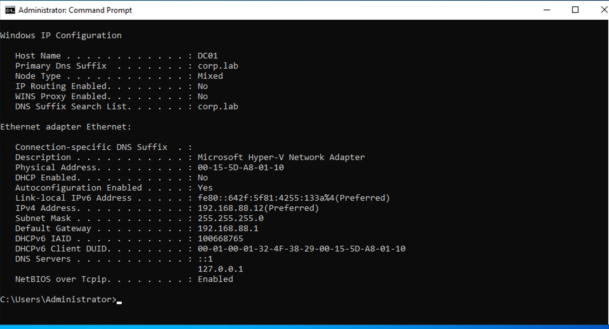
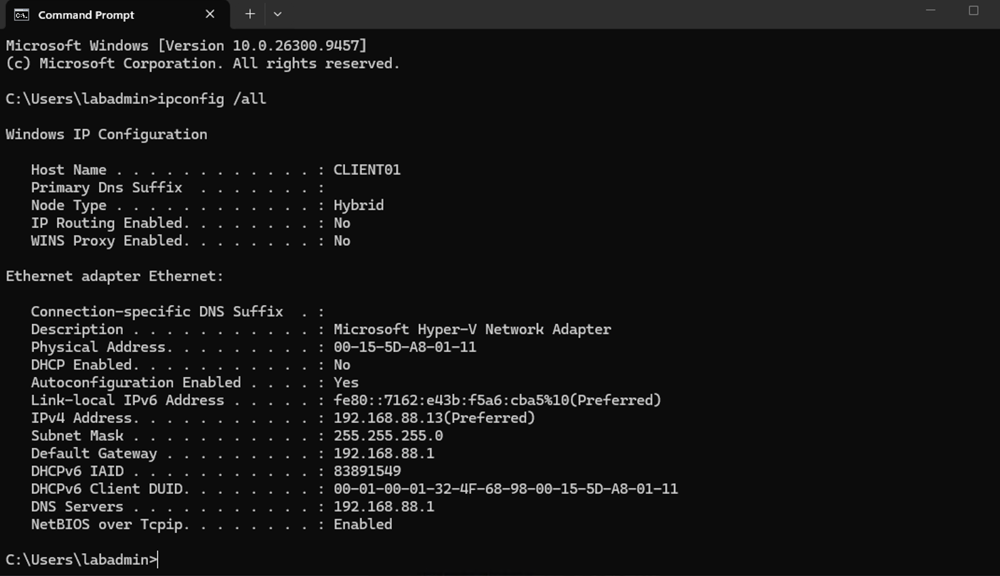

# 1. Hyper-V Lab Environment Overview

To practice Windows enterprise administration and IT support tasks, I built a small virtualized lab environment using **Microsoft Hyper-V** on a Windows 11 Pro host.

The lab contains one Windows Server and two Windows 11 client machines.

| Virtual Machine | Operating System    | Role                       | IP Address    |
| --------------- | ------------------- | -------------------------- | ------------- |
| DC01            | Windows Server 2022 | Server / Domain Controller | 192.168.88.12 |
| CLIENT01        | Windows 11 Pro      | Primary Client             | 192.168.88.13 |
| CLIENT02        | Windows 11 Pro      | Secondary Client           | 192.168.88.14 |

All three virtual machines are connected to the same **Hyper-V External Virtual Switch** and are placed on the same local network.

---

# 2 Hyper-V Network

An **External Virtual Switch** was created in Hyper-V and connected to the physical host's Wi-Fi adapter.

This allows the virtual machines to communicate with:

- The Windows host
- Other virtual machines
- The local network
- The Internet

The lab uses the following network:

```text
Network:         192.168.88.0/24
Default Gateway: 192.168.88.1
```

Basic connectivity between the virtual machines, the gateway, and the Internet was verified using tools such as `ipconfig` and `ping`.

---

# 3 DC01 — Windows Server 2022

`DC01` is the main Windows Server in the lab.

```text
Computer Name:   DC01
Operating System: Windows Server 2022
IP Address:      192.168.88.12
Subnet Mask:     255.255.255.0
Default Gateway: 192.168.88.1
```

A **static IPv4 address** was configured for DC01 because server infrastructure should use a stable and predictable address.

This is especially important because DC01 will later provide infrastructure services such as:

- Active Directory Domain Services (AD DS)
- DNS
- Group Policy
- Other Windows Server services used in the lab

A **fixed virtual MAC address** was also configured in Hyper-V. The server's IP and MAC information were kept consistent with the local network configuration to provide stable connectivity.



---

# 4 CLIENT01 — Windows 11 Pro

`CLIENT01` is the primary workstation used for most domain and IT support exercises.

```text
Computer Name:   CLIENT01
Operating System: Windows 11 Pro
IP Address:      192.168.88.13
Subnet Mask:     255.255.255.0
Default Gateway: 192.168.88.1
```

A fixed virtual MAC address and static IPv4 address were configured to make the lab environment predictable and easier to troubleshoot.

CLIENT01 will be used for tasks such as:

- Domain Join
- Domain user login
- Group Policy testing
- File and permission testing
- Windows troubleshooting
- Help Desk support scenarios



---

# 5 CLIENT02 — Windows 11 Pro

`CLIENT02` was created from the CLIENT01 base installation and then configured with its own computer identity and network settings.

```text
Computer Name:   CLIENT02
Operating System: Windows 11 Pro
IP Address:      192.168.88.14
Subnet Mask:     255.255.255.0
Default Gateway: 192.168.88.1
```

CLIENT02 has its own virtual MAC address and IP address.

It provides a second workstation for future multi-client scenarios and can be used to test different users, groups, policies, and configurations without affecting CLIENT01.

---

# 6 Final Lab Architecture

```text
                    Local Network
                   192.168.88.0/24
                          |
                 Gateway 192.168.88.1
                          |
                 Hyper-V External Switch
                          |
          +---------------+---------------+
          |               |               |
        DC01           CLIENT01        CLIENT02
 Windows Server       Windows 11      Windows 11
     2022                Pro             Pro
192.168.88.12       192.168.88.13    192.168.88.14
          |
     AD DS / DNS
   (Lab Services)
```

This environment provides a small but realistic Windows enterprise lab for practicing:

- Active Directory
- DNS
- Group Policy
- User and group administration
- File and NTFS permissions
- Domain administration
- Common Help Desk troubleshooting scenarios


