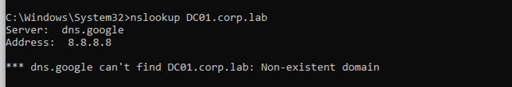
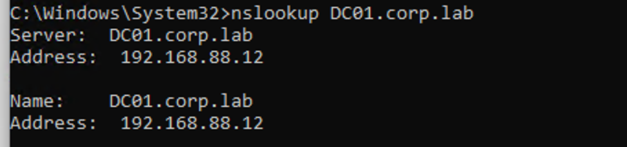
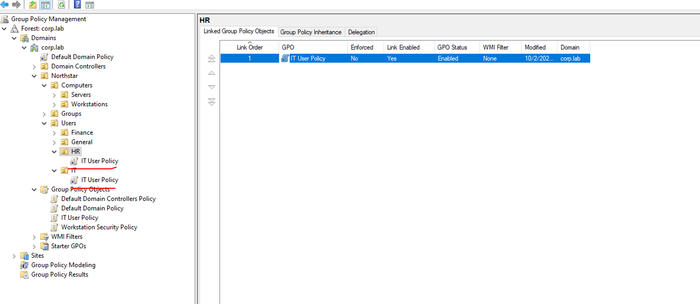
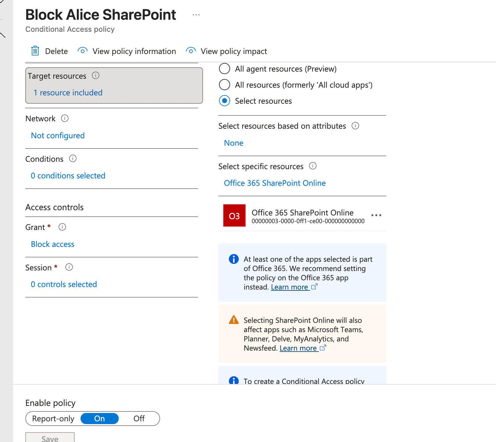
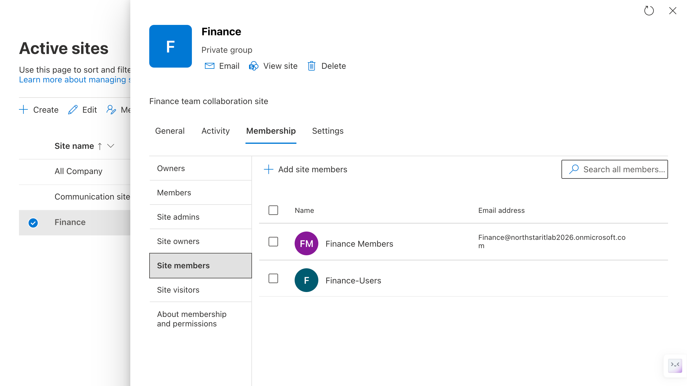
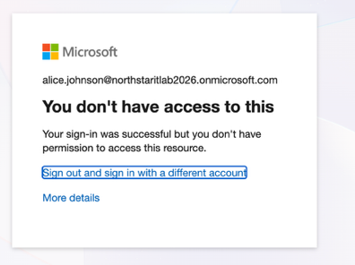
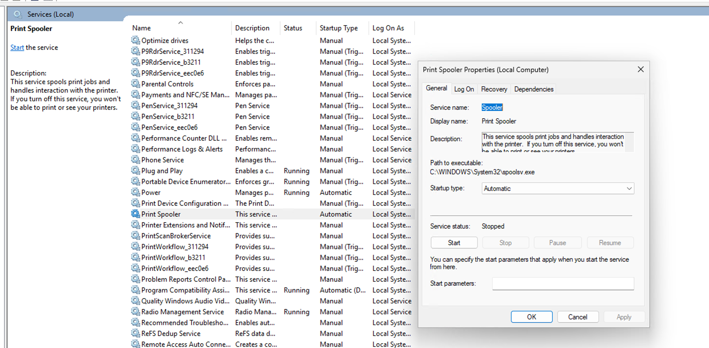

# 1.Windows Network / DNS Troubleshooting

## Problem

CLIENT01 had network connectivity but could not access resources by hostname.

## Troubleshooting

I first tested Internet connectivity by pinging an external IP address and hostname, and both worked normally.

I then tested connectivity to **DC01**. The server was reachable by IP address, but its hostname could not be resolved.

I used **nslookup** to investigate the DNS configuration and found that CLIENT01 was using **8.8.8.8** instead of the Active Directory DNS server **192.168.88.12**.

I changed the DNS server back to **192.168.88.12** and flushed the local DNS cache:

```cmd
ipconfig /flushdns
```

## Root Cause

CLIENT01 was configured with an incorrect DNS server.



## Resolution

I corrected the DNS configuration and verified that hostname resolution and network access were restored.




# 2.Active Directory Account Lockout

## Problem

A user entered an incorrect password multiple times and the domain account became locked, preventing the user from signing in.

## Troubleshooting and Resolution

I checked the user's account in **Active Directory Users and Computers (ADUC)** and confirmed that the account was locked.

I unlocked the account and reset the user's password.

As part of the password reset, I enabled **User must change password at next logon**, requiring the user to create a new password after signing in.

I then verified that the account was no longer locked and that domain authentication was working normally.

## Result

The account was successfully unlocked, the password was reset, and the user regained access to the domain account.


# 3.Shared Folder Access Denied

## Problem

A user reported that she could not access the shared folder **\\DC01\Finance**.

## Troubleshooting

I first pinged **DC01** and confirmed that the server was reachable.

I then tried to access **\\DC01\Finance** in File Explorer and received an **Access Denied** error.

I checked the folder permissions on DC01:

- **NTFS permissions:** Finance-Users had access.
- **Share permissions:** Finance-Users had access.

Since both permissions were configured correctly, I checked the user's current group membership:

```cmd
whoami /groups
```

The result showed that the user belonged to **CORP\IT-Users**, but not **CORP\Finance-Users**.

## **Root Cause**

The user was not a member of the **Finance-Users** security group required to access the Finance shared folder.

## **Resolution**

After confirming that the user required Finance access, the user could be added to **Finance-Users** and sign in again to receive the updated group membership.


# 4.Group Policy Not Applying

## Problem

Bob could still access **Control Panel**, although a Group Policy should have restricted access.

## Troubleshooting

I refreshed Group Policy and checked the policies applied to Bob:

- **gpupdate /force** — refresh Group Policy.
- **gpresult /r** — check applied Group Policies.

The result showed that no user Group Policy was applied to Bob.

I checked **Group Policy Management** on DC01 and found that **IT User Policy** was linked to the **IT OU**, while Bob was located in the **HR OU**.

## Root Cause

The GPO was linked to the wrong OU for Bob.

## Resolution

I linked the existing **IT User Policy** to the **HR OU**.

After refreshing Group Policy, **gpresult /r** showed that the policy was applied successfully.

Bob could no longer access **Control Panel**.




# 5.SharePoint Access Denied

## Problem

Alice reported that she could not access the **Finance SharePoint site**.

## Troubleshooting

I first verified that Alice had a valid Microsoft 365 license.

I then checked the **Conditional Access policy** and found that Alice was blocked from accessing **Office 365 SharePoint Online**.



I also checked the **Finance SharePoint site membership** and found that access was granted to **Finance-Users**, but Alice was not a member of this group.



Finally, I tested the Finance site using Alice's account. Authentication succeeded, but access to the resource was denied.



## Root Cause

Alice did not have access for two reasons:

1. A Conditional Access policy blocked her from accessing SharePoint Online.
2. She was not authorized to access the Finance SharePoint site.

## Resolution

The access restriction was working as configured.

The issue should be escalated to the appropriate administrator or manager to determine whether Alice should be granted Finance access and whether the Conditional Access restriction should be changed.


# 6.Printer Not Working

## Problem

A user reported that they could not print to a network printer.

## Troubleshooting and Resolution

I first pinged the printer's IP address and confirmed that the network connection was working normally.

I then checked the printer itself and confirmed that it was online and operating normally.

I opened **Services (services.msc)** and found that the **Print Spooler** service was stopped.

I checked **Event Viewer → Windows Logs → System** and reviewed the **Event ID, message, and timestamp**, but did not find any relevant event that clearly explained why the Print Spooler had stopped.

I restarted the **Print Spooler** service and verified that it was running normally again.

## Result

Printing functionality was restored after restarting the Print Spooler service.




# 7.Domain User Cannot Sign In

## Problem

A domain user reported that they could not sign in to a domain-joined Windows computer.

## Troubleshooting

I first checked the user's account status in **Active Directory Users and Computers (ADUC)**.

I verified whether:

- The account was locked out.
- The account was disabled.
- The account had expired.
- The password had expired or needed to be reset.

I then checked the client computer's network connectivity and verified that it could communicate with the **Domain Controller**.

I also checked **DNS configuration** and name resolution to make sure that the client was using the Active Directory DNS server and could resolve the domain and Domain Controller correctly.

During the account check, I found that the user's Active Directory account was **disabled**.

## Root Cause

The user's Active Directory account had been disabled.

## Resolution

After confirming that the user was still authorized to access the domain, I enabled the account in **Active Directory Users and Computers**. I then verified that the user could successfully sign in to the domain computer.


# 8.Mapped Network Drive Not Available

## Problem

A user reported that the mapped **F:** drive was no longer accessible.

The drive was mapped to the shared folder **\\\DC01\Finance**.

## Troubleshooting

I first tested network connectivity to **DC01** using **ping** and confirmed that the file server was reachable.

I then tested the shared folder directly using its UNC path: **\\\DC01\Finance**

The shared folder was accessible through the UNC path, confirming that the server and the shared folder were available.

I checked the user's identity and group membership and verified that the user had the required **Share permissions** and **NTFS permissions**.

I then checked the current mapped network drives: **net use**

The result showed that the **F:** drive mapping was disconnected.

## Root Cause

The existing **F:** drive mapping was no longer connected correctly, while the shared folder itself remained accessible through its UNC path.

## Resolution

I removed the disconnected F: drive mapping:

    net use F: /delete

I then recreated the mapping:

    net use F: \\DC01\Finance

Finally, I verified that the user could access the Finance share through the **F:** drive.


# 9.OneDrive Not Syncing

## Problem

A user reported that files in **OneDrive** were not syncing correctly.

## Troubleshooting

I first verified that the user was signed in to the correct OneDrive account and that the account was active.

I checked the network connection and confirmed that Internet access was working normally.

I then checked both the local disk space and the available OneDrive cloud storage to make sure there was enough space for synchronization.

I checked the **OneDrive sync status** from the OneDrive icon in the Windows taskbar and reviewed any reported sync errors.

I also determined whether the issue affected all files or only specific files or folders.

For files that were not syncing, I checked:

- Whether the files were located inside the OneDrive sync folder.
- Whether there were problems with the file name or path.
- Whether the files were currently in use or otherwise unable to sync.

The account, network connection, storage, and files were normal, but the OneDrive client was not syncing correctly.

## Root Cause

The OneDrive desktop client had stopped syncing even though the account, network connection, storage, and files were normal.

## Resolution

I restarted the OneDrive client and signed the user out and back in.

After reconnecting the account, I verified the OneDrive sync status and confirmed that the files started syncing again.


# 10.Intune Device Not Receiving Policy

## Problem

A managed Windows device was not receiving an assigned **Intune configuration policy**.

## Troubleshooting

I first verified that the device was properly enrolled in **Intune** and was being managed successfully.

I then manually synchronized the device:

**Settings → Accounts → Access work or school → Managed by organization → Info → Sync**

After synchronization, the expected policy was still not applied.

I checked the policy assignment in the **Intune Admin Center** and verified which user or device group the policy was assigned to.

I then checked the device's group membership and found that the device was not a member of the group targeted by the policy.

I also reviewed the policy deployment status in Intune, including:

- **Succeeded**
- **Pending**
- **Error**
- **Conflict**
- **Not applicable**

## Root Cause

The Intune configuration policy was assigned to a device group that did not include the affected device.

As a result, the device was outside the scope of the policy and did not receive the configuration.

## Resolution

I added the device to the correct Intune device group. I then manually synchronized the device again and checked the policy deployment status in Intune. After synchronization, the policy was successfully applied to the device.


 


