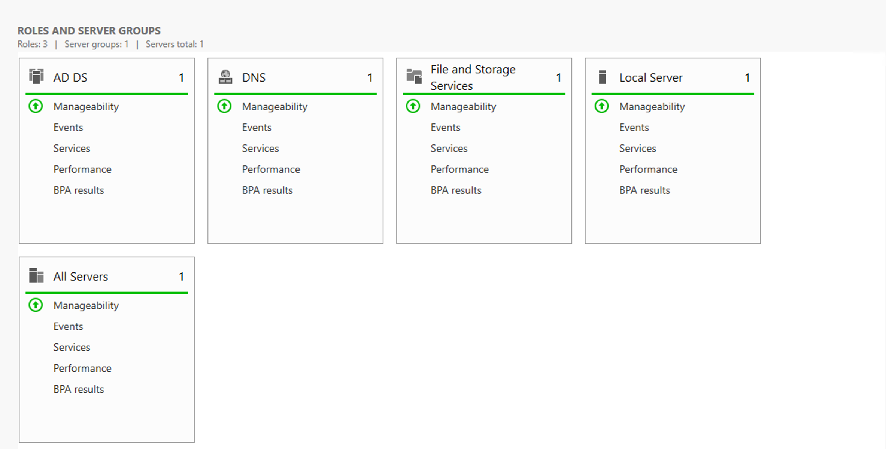
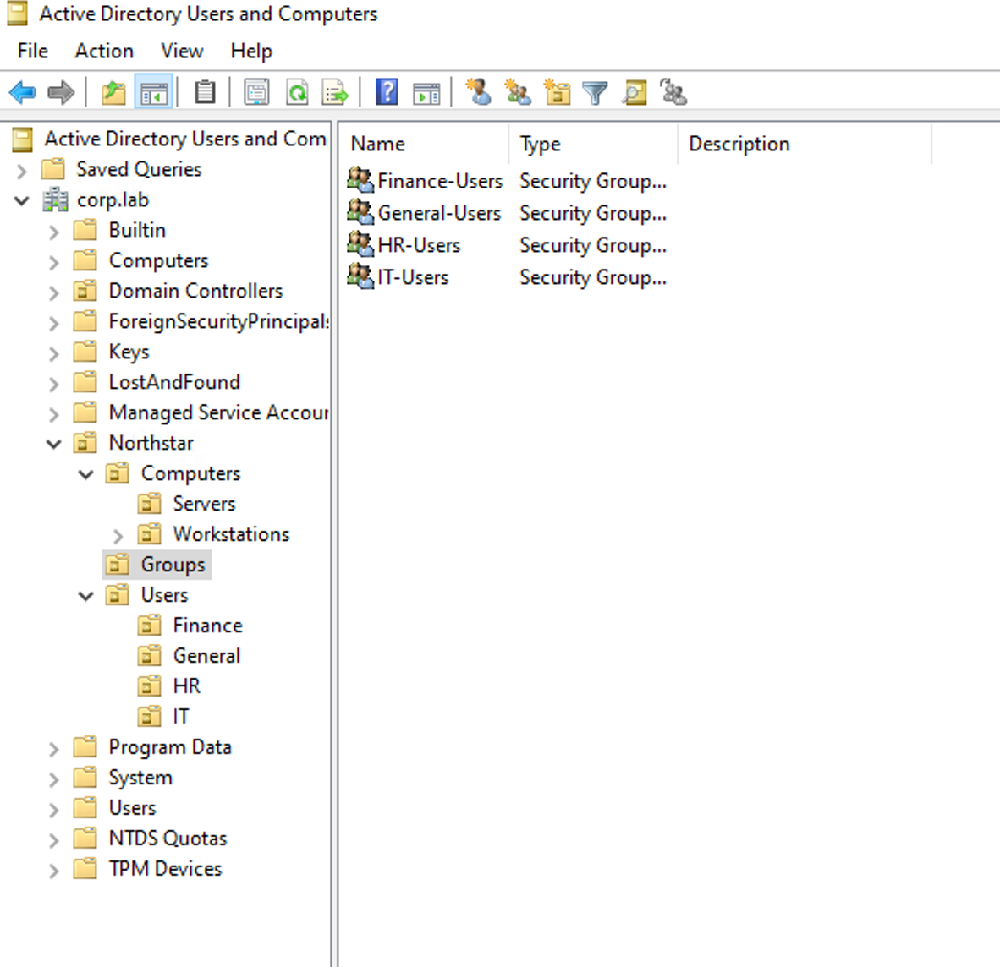
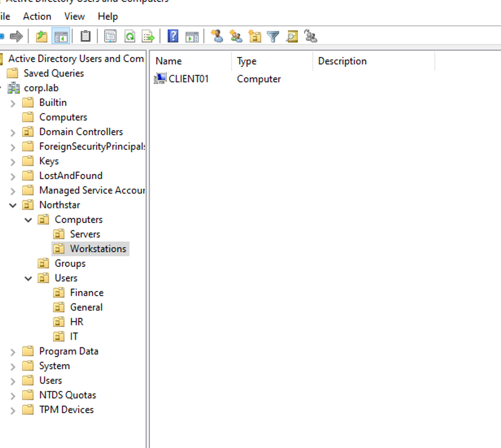
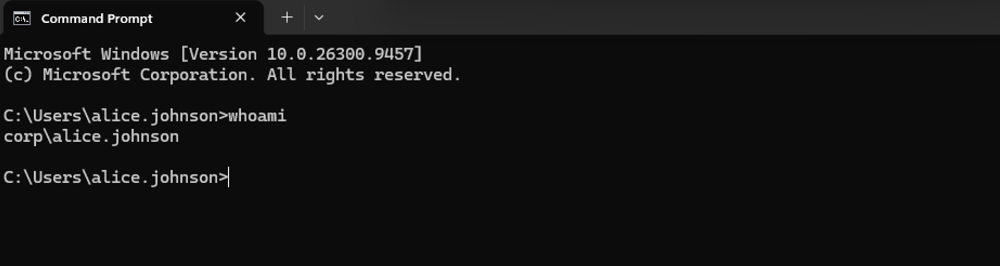

# 1.Active Directory Domain Deployment and OU Structure

## 1.1 Objective

The goal of this chapter is to deploy the core Active Directory environment for the Northstar Technologies lab.

A Windows Server 2022 virtual machine named `DC01` is used as the Domain Controller for the environment.

The Active Directory domain is: **corp.lab**

After the domain is created, a custom Organizational Unit (OU) structure is built to represent a small business environment.

This structure will later be used for:

- User and computer management
- Security group management
- Group Policy
- File permissions
- Domain-joined workstations
- Help Desk troubleshooting scenarios

---

## 1.2 Deploy Active Directory Domain Services

Active Directory Domain Services (AD DS) was installed on `DC01` through Windows Server Manager.

The server configuration used for the domain environment is:

    Server:        DC01
    Operating OS:  Windows Server 2022
    Domain:        corp.lab
    IP Address:    192.168.88.12
    Role:          Domain Controller

Because DC01 provides core infrastructure services, it uses a stable static IP address.

After installing the AD DS role, DC01 was promoted to a Domain Controller and a new Active Directory forest was created using: **corp.lab**

DNS was also installed as part of the Active Directory deployment because Active Directory depends on DNS for locating domain services and resources.

After the promotion process completed, DC01 restarted and became the Domain Controller for the new `corp.lab` domain.



---

## 1.3 Verify the Active Directory Domain

After the Domain Controller deployment, **Active Directory Users and Computers (ADUC)** was opened to confirm that the new domain was available.

The standard Active Directory containers and OUs were also created automatically, including:

    Builtin
    Computers
    Domain Controllers
    ForeignSecurityPrincipals
    Managed Service Accounts
    Users

This confirmed that the `corp.lab` Active Directory domain had been created successfully and could be administered through ADUC.

---

## 1.4 Build the Northstar Organizational Unit Structure

After completing the initial Active Directory deployment, the Northstar Technologies OU structure is:

    corp.lab
    │
    ├── Builtin
    ├── Computers
    ├── Domain Controllers
    ├── ForeignSecurityPrincipals
    ├── Managed Service Accounts
    ├── Users
    │
    └── Northstar
        │
        ├── Users
        │   ├── IT
        │   ├── HR
        │   ├── Finance
        │   └── General
        │
        ├── Computers
        │   ├── Workstations
        │   └── Servers
        │
        └── Groups

The completed OU structure provides the organizational foundation for the remaining Active Directory administration tasks in the lab.

At this stage:

- DC01 is operating as the Domain Controller.
- The `corp.lab` domain is operational.
- Active Directory can be administered through ADUC.
- The Northstar organizational structure has been created.
- Dedicated organizational structures exist for users, computers, and security groups.
- The environment is ready for user, group, and computer object administration.


# 2. Active Directory Users and Security Groups

## 2.1 Objective

After building the `corp.lab` domain and Northstar OU structure, representative domain users and Security Groups were created to simulate a small business identity environment.

The goal was to establish a simple structure that can later be used for Group Policy, file permissions, Microsoft 365, hybrid identity, and Help Desk troubleshooting.

The lab also included basic Active Directory administration such as managing group membership, moving users between OUs, and reviewing common account operations including password reset, account unlock, disable, and delete.

---

## 2.2 Final User and Group Structure

The completed structure is:

```text
corp.lab
└── Northstar
    │
    ├── Users
    │   ├── IT
    │   │   └── Alice Johnson
    │   ├── HR
    │   │   └── Bob Smith
    │   ├── Finance
    │   │   └── Davis
    │   └── General
    │       └── Wilson
    │
    ├── Computers
    │   ├── Workstations
    │   └── Servers
    │
    └── Groups
        ├── IT-Users
        ├── HR-Users
        ├── Finance-Users
        └── General-Users
```

The departmental users were assigned to the corresponding **Global Security Groups**:

```text
Alice Johnson → IT-Users
Bob Smith     → HR-Users
Davis         → Finance-Users
Wilson        → General-Users
```

This separates **organizational structure (OUs)** from **access management (Security Groups)** and provides the identity foundation for later parts of the lab.




# 3. Join CLIENT01 to the Active Directory Domain

## 3.1 Objective

The goal of this chapter is to join the Windows 11 workstation `CLIENT01` to the `corp.lab` Active Directory domain and verify that a domain user can successfully sign in to the workstation.

## 3.2 Configure CLIENT01 and Join the Domain

Before joining the domain, the network configuration of CLIENT01 was verified:

- Computer name: `CLIENT01`
- IP address: `192.168.88.13`
- Default gateway: `192.168.88.1`

The DNS server on CLIENT01 was changed from the home router to the Domain Controller: **Preferred DNS: 192.168.88.12 (DC01)**

This allows CLIENT01 to use the Active Directory DNS service to locate the **corp.lab** domain and its Domain Controller.

DNS resolution was verified before proceeding with the domain join.

CLIENT01 was then changed from its default **WORKGROUP** membership to the Active Directory domain: **corp.lab**

Domain Administrator credentials were provided to authorize the domain join. After restarting CLIENT01, the workstation became a member of the **corp.lab** domain.

The CLIENT01 computer object was also placed under:

    Northstar
    └── Computers
        └── Workstations
            └── CLIENT01



## 3.3 Verify Domain User Login

To verify that the domain environment was functioning correctly, the domain user: **CORP\alice.johnson** was used to sign in to CLIENT01.

The first remote login attempt was rejected because Alice did not have permission to sign in through Remote Desktop Services.

To resolve this, Alice was added to the local **Remote Desktop Users group** on CLIENT01.

After the permission change, Alice successfully signed in to CLIENT01 through Remote Desktop.



## **3.4 Troubleshooting — Domain User Unable to Log In Through RDP**

After **CLIENT01** successfully joined the **corp.lab** domain, I tested domain user access to the workstation.

**CORP\alice.johnson** could log in locally to CLIENT01, but the same account could not log in through Remote Desktop.

To isolate the problem, I tested **CORP\Administrator**. The Domain Administrator could log in both locally and through RDP, indicating that the domain join and authentication were working correctly and that the issue was related to user permissions.

The cause was that **Domain Admins** have administrative privileges on domain-joined workstations and can use RDP by default, while a regular domain user such as Alice does not automatically have Remote Desktop logon rights.

I added **CORP\alice.johnson** to the local **Remote Desktop Users** group on CLIENT01.

After the permission change, Alice successfully logged in to CLIENT01 through RDP.

**Result:** The issue was identified as an authorization problem rather than an authentication or domain-join problem.


