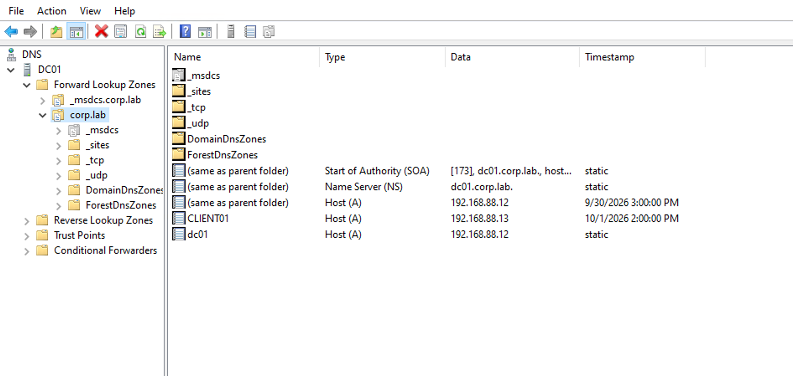
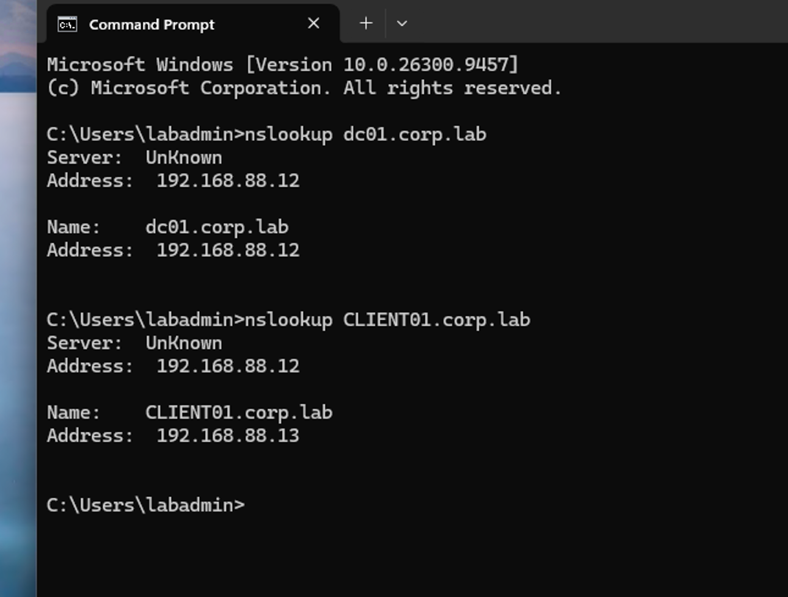
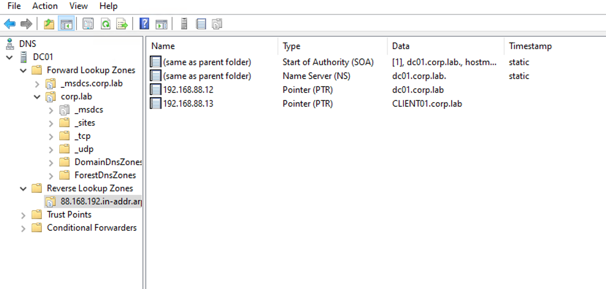
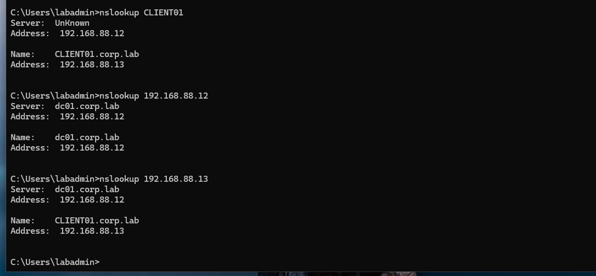
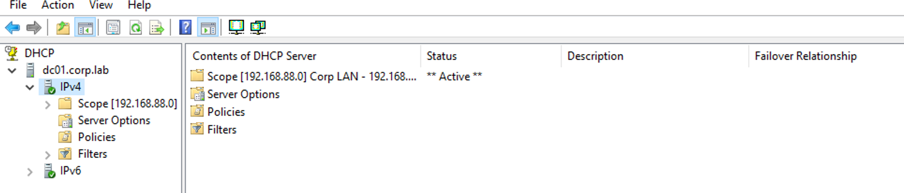

# 1. DNS and DHCP Overview

After deploying the **corp.lab** Active Directory domain and joining **CLIENT01** to the domain, the next stage is to configure and verify the core network services used by the domain environment: **DNS and DHCP**.

**DC01 (192.168.88.12)** already provides DNS services for the **corp.lab** domain as part of the Active Directory deployment. CLIENT01 is also configured to use DC01 as its DNS server.

In this chapter, the existing DNS environment will be examined and tested to understand how domain clients locate the Domain Controller and other network resources.

The lab will then deploy **DHCP on DC01** to provide centralized IP configuration for domain workstations instead of relying on manually configured client addresses.

The main goals are:

- Verify the existing Active Directory DNS configuration.
- Examine and manage common DNS records.
- Test internal and external DNS resolution.
- Install and configure DHCP on DC01.
- Create a DHCP scope for the lab network.
- Configure DHCP options such as **default gateway** and **DNS server**.
- Change CLIENT01 from a static IP configuration to DHCP and verify that it receives the correct network settings.
- Practice basic DNS and DHCP troubleshooting.

After this stage, **DC01 will provide both DNS and DHCP services for the Northstar lab**, creating a more realistic centrally managed Windows domain network.


# **2. DNS Configuration and Verification**

## **2.1 Verify the Existing Forward Lookup Zone**

DNS was installed on **DC01** as part of the Active Directory Domain Services deployment.

The DNS environment was reviewed through **DNS Manager**:

```
DC01
└── Forward Lookup Zones
    └── corp.lab
```

The **corp.lab** Forward Lookup Zone already contained Host (A) records for the Domain Controller and domain-joined workstation:

```
dc01      → 192.168.88.12
CLIENT01  → 192.168.88.13
```



DC01 registered its DNS information as part of the Active Directory/DNS deployment. After CLIENT01 joined the domain and was configured to use DC01 as its DNS server, its host record was dynamically registered in the **corp.lab** DNS zone.

Forward DNS resolution was tested from CLIENT01 using **nslookup**:

```
nslookup dc01.corp.lab
nslookup CLIENT01.corp.lab
```

Both names successfully resolved to their corresponding IP addresses, confirming that Forward Lookup was functioning correctly.



------

## **2.2 Configure the Reverse Lookup Zone**

Unlike the Forward Lookup Zone, no Reverse Lookup Zone existed for the lab network.

A new **IPv4 Reverse Lookup Zone** was therefore created on DC01 for the network:

```
Network ID: 192.168.88
Network:    192.168.88.0/24
```

The resulting Reverse Lookup Zone was:

```
88.168.192.in-addr.arpa
```

The zone was configured as an **Active Directory-integrated Primary Zone** with **secure dynamic updates** enabled.

PTR records were then created for DC01 and CLIENT01:

```
192.168.88.12 → dc01.corp.lab
192.168.88.13 → CLIENT01.corp.lab
```

------






# **3. DHCP Configuration**

## **3.1 Overview**

DHCP (Dynamic Host Configuration Protocol) automatically provides network configuration to client computers.

Instead of manually configuring network settings on every client, a DHCP server can automatically provide information such as:

- IP address
- Subnet mask
- Default gateway
- DNS server
- DNS domain name

In this lab, **DC01** was configured as the DHCP server for the `corp.lab` domain.

------

## **3.2 Install and Authorize the DHCP Server**

The **DHCP Server** role was installed on DC01 through Server Manager.

After installation, the DHCP server was authorized in Active Directory using the `CORP\Administrator` account.

Authorization allows DC01 to operate as an authorized DHCP server in the Active Directory domain.

------

## **3.3 Configure the DHCP Scope**

A DHCP scope named **Corp LAN** was created for the `192.168.88.0/24` network.

The following settings were configured:

| **Setting**        | **Value**                         |
| ------------------ | --------------------------------- |
| Scope              | `192.168.88.0/24`                 |
| DHCP Address Range | `192.168.88.100 – 192.168.88.200` |
| Subnet Mask        | `255.255.255.0`                   |
| Default Gateway    | `192.168.88.1`                    |
| DNS Server         | `192.168.88.12` (DC01)            |
| DNS Domain         | `corp.lab`                        |
| Lease Duration     | Default (8 days)                  |
| WINS Server        | Not configured                    |




