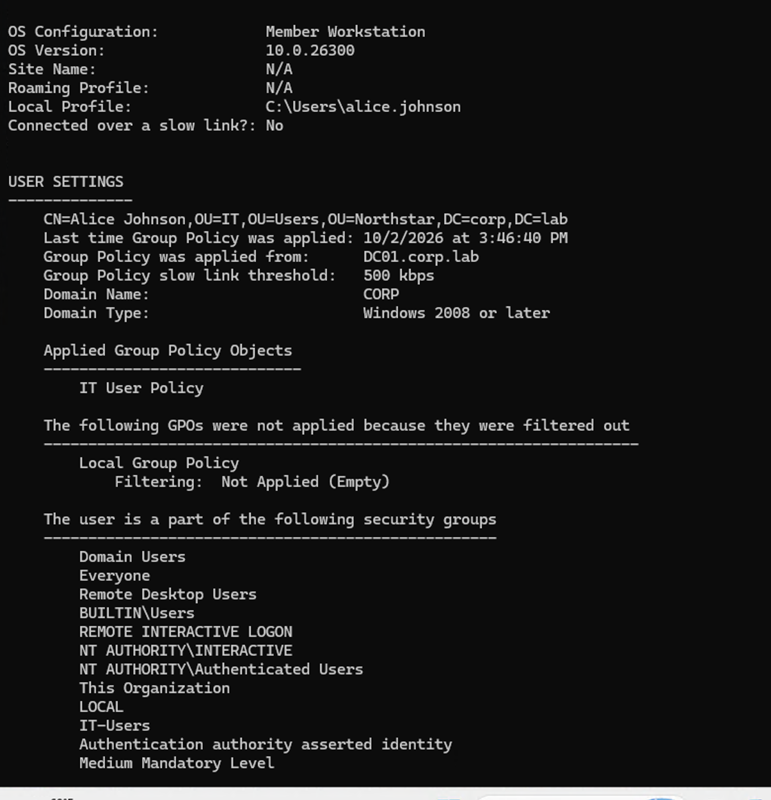
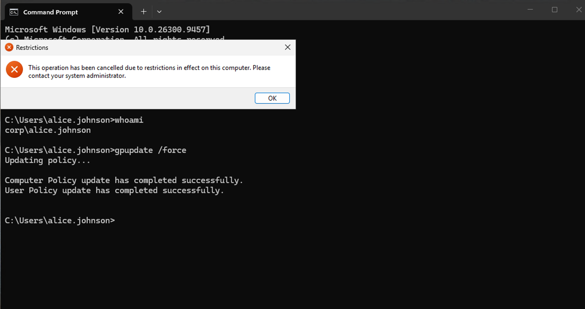
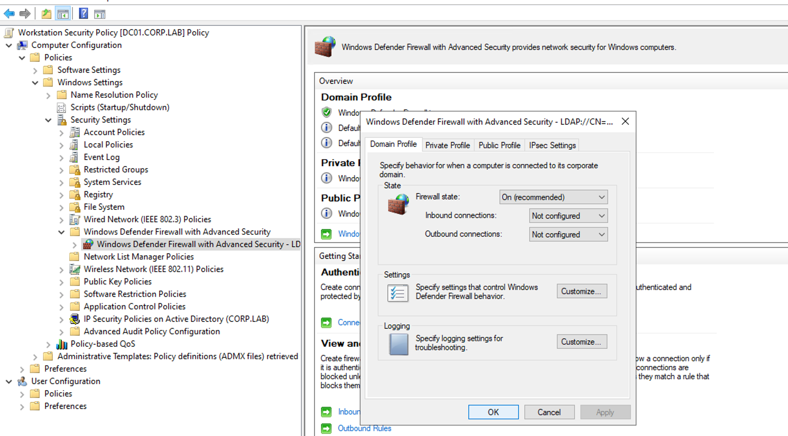
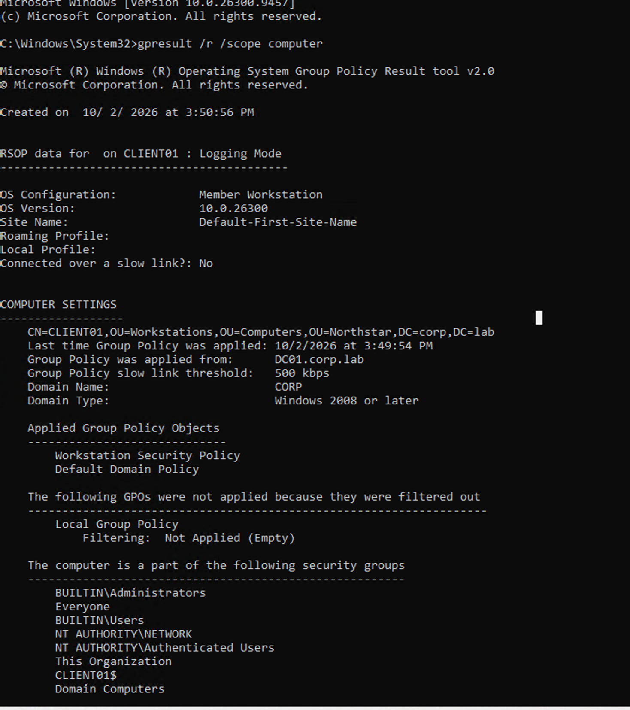

# **1. Group Policy Overview**

The goal of this chapter is to configure **Group Policy** in the `corp.lab` domain and verify that policies can be centrally applied to domain users and computers.

**Group Policy (GPO)** allows administrators to centrally manage Windows settings across an Active Directory environment. Instead of configuring each computer or user account individually, administrators can create policies and apply them to specific **Organizational Units (OUs)**.

Group Policy can be used to manage security settings, Windows configuration, user environments, and other enterprise policies. When users or computers are placed in the appropriate OU, the linked policies can be automatically applied to them.

In this lab, Group Policies will be created and linked to the existing **Northstar OU structure**. The policies will then be applied and verified on **CLIENT01** to demonstrate centralized management of domain users and workstations.


# **2. Group Policy Design**

The Group Policy lab will deploy two policies to demonstrate centralized management of both **domain users** and **domain computers**.

The planned Group Policy structure is:

```text
corp.lab
└── Northstar
    │
    ├── Users
    │   ├── Finance
    │   ├── General
    │   ├── HR
    │   └── IT
    │       └── Alice Johnson
    │
    │       ↑ Link GPO here
    │       IT User Policy
    │
    ├── Computers
    │   ├── Servers
    │   └── Workstations
    │       └── CLIENT01
    │
    │       ↑ Link GPO here
    │       Workstation Security Policy
    │
    └── Groups
        ├── Finance-Users
        ├── General-Users
        ├── HR-Users
        └── IT-Users
            [Security Groups]
```

Two Group Policy Objects (GPOs) will be created.

### 2.1.**IT User Policy**

The **IT User Policy** will be linked to the **IT OU** and will apply to users stored in that OU.

The policy will configure:

**Prohibit access to Control Panel and PC settings**

Alice Johnson will be used to verify that the User Configuration policy is successfully applied.

### 2.2**Workstation Security Policy**

The **Workstation Security Policy** will be linked to the **Workstations OU** and will apply to computers stored in that OU.

A Windows security setting will be configured through **Computer Configuration** and applied to CLIENT01.

CLIENT01 will be used to verify that the Computer Configuration policy is successfully applied.

The lab therefore demonstrates both major Group Policy paths:

```text
User OU     → User Configuration     → Domain User
Computer OU → Computer Configuration → Domain Computer
```


# **3. Group Policy Configuration**

Two Group Policy Objects were configured to demonstrate centralized management of **domain users** and **domain computers**.

## **3.1 IT User Policy**

The **IT User Policy** was created and linked to the **Northstar → Users → IT OU**.

The policy uses **User Configuration** to **prohibit access to Control Panel and PC settings**. This demonstrates how Group Policy can centrally restrict Windows settings for users within a specific OU.

The policy was tested with **Alice Johnson**, a domain user in the IT OU. After the policy was applied, Alice was successfully prevented from accessing Control Panel on CLIENT01.






------

## **3.2 Workstation Security Policy**

The **Workstation Security Policy** was created and linked to the **Northstar → Computers → Workstations OU**.

The policy uses **Computer Configuration** to enforce **Windows Defender Firewall** for the Domain Profile. This demonstrates how Group Policy can centrally maintain security settings on domain workstations.

The policy was applied to **CLIENT01**, which is located in the Workstations OU. The `gpresult` command confirmed that **Workstation Security Policy** was successfully applied to the computer.






