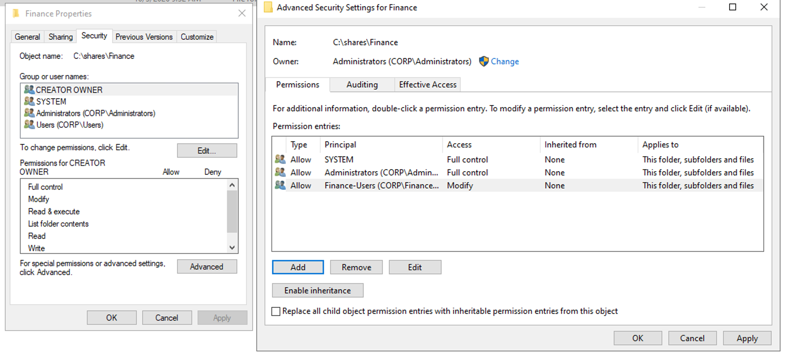
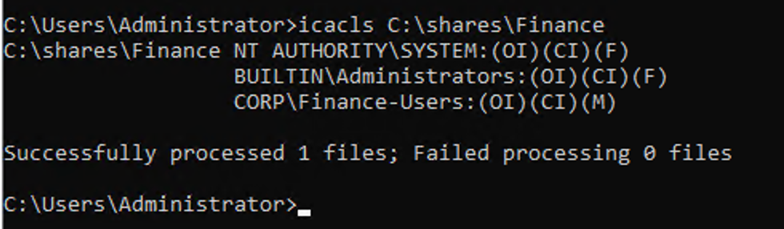
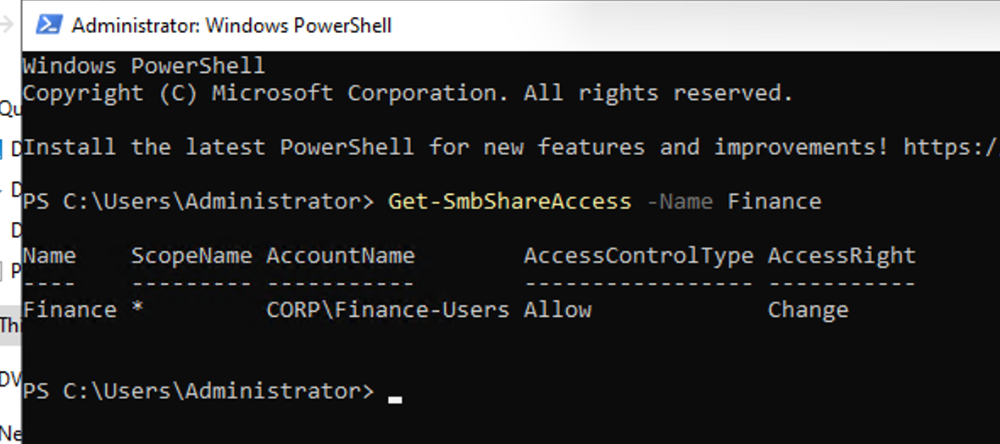
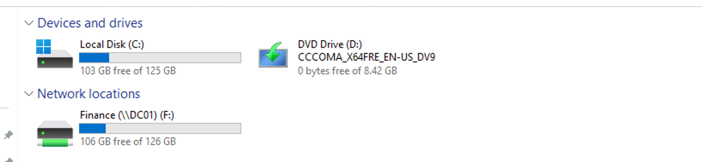

# **1. File Sharing and Permissions Overview**

In a Windows domain environment, file servers are commonly used to provide shared folders that multiple users can access over the network.

Windows uses two main types of permissions to control access to shared files and folders:

- **Share Permissions** control what users can do when accessing a shared folder **over the network**.
- **NTFS Permissions** control what users can do with files and folders stored on an **NTFS file system**, whether they are accessed locally or through the network.

Common permissions include **Read**,  **Write**, **Modify**, and **Full Control**.

When a user accesses a shared folder over the network, both Share Permissions and NTFS Permissions are evaluated. The user’s effective access is determined by the combination of these permissions.

## **Lab Goal**

In this lab, DC01 will provide shared folders for different departments in the **Northstar** domain.

Existing Active Directory Security Groups, such as **IT-Users, HR-Users, Finance-Users, and General-Users**, will be used to control access to these folders.

The lab will demonstrate how an administrator can:

- Create and publish shared folders on a Windows server.
- Assign Share Permissions and NTFS Permissions.
- Use Active Directory Security Groups to manage access instead of assigning permissions individually to users.
- Verify that different domain users can access only the resources they are authorized to use.

This demonstrates a common enterprise file-access model:

```text
Domain User
    ↓
Security Group
    ↓
Share Permission + NTFS Permission
    ↓
Shared Folder
```


# **2. NTFS Permission Configuration**

In this section, we configured NTFS permissions for the Finance shared folder: C:\shares\Finance

The goal was to allow members of the **Finance-Users** domain group to work with files in this folder while preventing other regular users from accessing it.

## **2.1 Disable Permission Inheritance**

By default, the Finance folder **inherited** NTFS permissions from its parent folder. The inherited permissions included entries for:

- SYSTEM
- Administrators
- Users
- CREATOR OWNER

To manage the Finance folder independently, we disabled permission inheritance and converted the existing inherited permissions into explicit permissions.

This allowed us to modify or remove the permission entries directly on the Finance folder without changing permissions on the parent folder.

## **2.2 Remove Unnecessary Permissions**

After disabling inheritance, we removed the following permission entries:

- **Users**
- **CREATOR OWNER**

We retained:

- **SYSTEM — Full Control**
- **Administrators — Full Control**

This created a clean permission structure where Windows and administrators retained full administrative access, while regular users were not automatically granted access to the Finance folder.

## **2.3 Grant Access to Finance Users**

We then added the domain security group: **CORP\Finance-Users**

and assigned: **Modify — This folder, subfolders and files**

The Modify permission allows Finance users to read, create, edit, and delete files and folders without granting administrative control over the folder’s security configuration.

The final NTFS permission structure is:

| **Principal**       | **Permission** | **Applies To**                    |
| ------------------- | -------------- | --------------------------------- |
| SYSTEM              | Full Control   | This folder, subfolders and files |
| CORP\Administrators | Full Control   | This folder, subfolders and files |
| CORP\Finance-Users  | Modify         | This folder, subfolders and files |






# **3. Share Permission Configuration**

After configuring the NTFS permissions, we configured the **Share Permissions** for the Finance folder so that authorized users can access the folder over the network.

The folder was shared with the following configuration:

- **Folder:** `C:\shares\Finance`
- **Share Name:** `Finance`
- **Network Path:** `\\DC01\Finance`
- **Authorized Group:** `CORP\Finance-Users`
- **Share Permission:** `Change`

The default `Everyone` permission was removed, and `CORP\Finance-Users` was added with **Change** permission.

With this configuration, members of the `Finance-Users` group are allowed to access and modify files through the network share. Network access is controlled by both the **Share Permission** and the **NTFS Permission** configured in the previous section.

The final Share Permission configuration was verified with PowerShell: **Get-SmbShareAccess -Name Finance**

The result confirmed that `CORP\Finance-Users` has **Allow – Change** permission on the `Finance` share.



Finally, the Finance shared folder was mapped to the **F:** drive on CLIENT01, allowing authorized users to access the network share directly through File Explorer.




