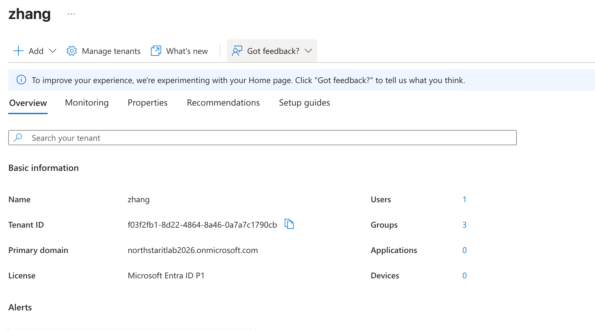
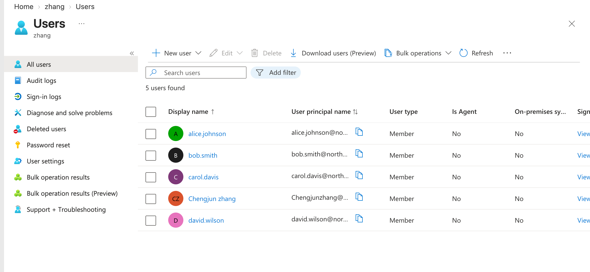
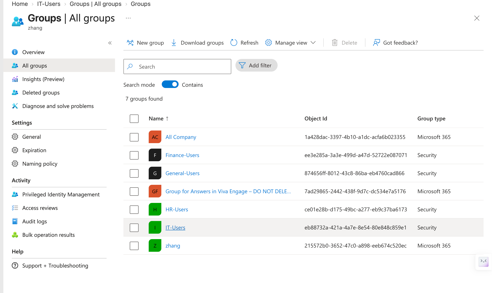
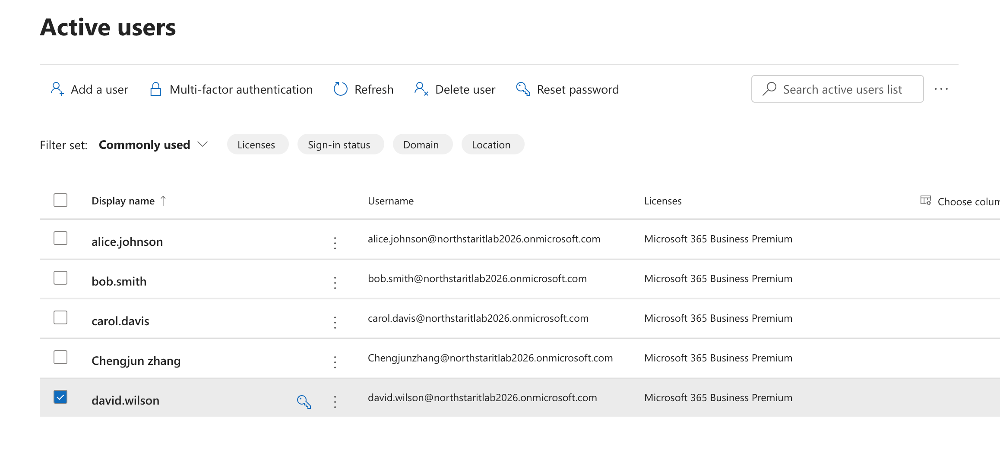
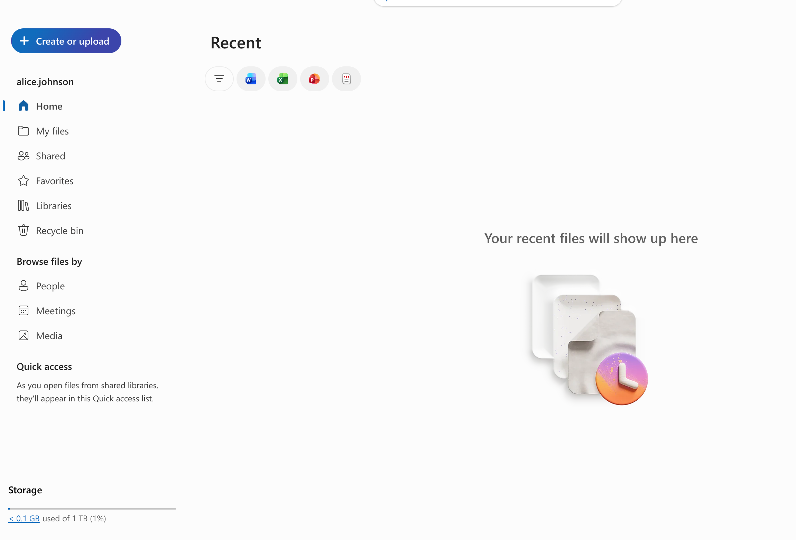

# **1. Microsoft Entra ID Environment Setup**

## **1.1 Objective**

Northstar Technologies currently uses an on-premises Active Directory environment.

The next stage of the project extends the IT environment to Microsoft cloud services. The lab will use Microsoft Entra ID, Microsoft 365, and Microsoft Intune to practice cloud identity, access, and device management.

## **1.2 Microsoft Cloud Environment**

A Microsoft 365 Business Premium trial was created for the lab.

The environment includes:

- Microsoft Entra ID
- Microsoft 365 services
- Microsoft Intune
- Microsoft Entra ID P1

The primary domain is:

**northstaritlab2026.onmicrosoft.com**

## **1.3 Microsoft Entra Tenant**

The Microsoft Entra tenant is the main identity and management boundary for the organization’s cloud environment.

The tenant can contain and manage:

- Users
- Groups
- Devices
- Applications
- Domains
- Policies

The tenant has a globally unique **Tenant ID** used by Microsoft to identify the organization.

A tenant can contain multiple verified domains. Domains provide identity namespaces that can be used in user sign-in names such as:

**alice@northstaritlab2026.onmicrosoft.com**

Users, groups, devices, applications, and policies belong to the tenant rather than to an individual domain.

# 2. Microsoft Entra ID Users

Created four cloud users in Microsoft Entra ID to represent the existing users in the on-premises Active Directory environment:

- alice.johnson — IT
- bob.smith — HR
- david.wilson — General
- carol.davis — Finance

The users were successfully created and are now available in the Entra ID tenant.

# 3. Microsoft Entra ID Groups

Created four security groups in Microsoft Entra ID to organize the cloud users by department:

- IT-Users — alice.johnson
- HR-Users — bob.smith
- Finance-Users — carol.davis
- General-Users — david.wilson

All groups use the **Assigned** membership type.

These security groups can later be used to assign access, policies, and other resources to users as groups instead of managing users individually.

# **4. Microsoft 365 License Assignment**

To enable Microsoft 365 services for the cloud users, **Microsoft 365 Business Premium** licenses were assigned to the four users created in Microsoft Entra ID:

- alice.johnson
- bob.smith
- carol.davis
- david.wilson

After the assignment, all four users had active Microsoft 365 Business Premium licenses.

**I created cloud identities, assigned Microsoft 365 Business Premium licenses, and verified Microsoft 365 service access by signing in as a standard user.**

