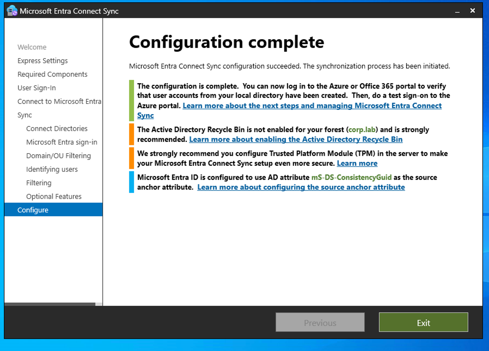
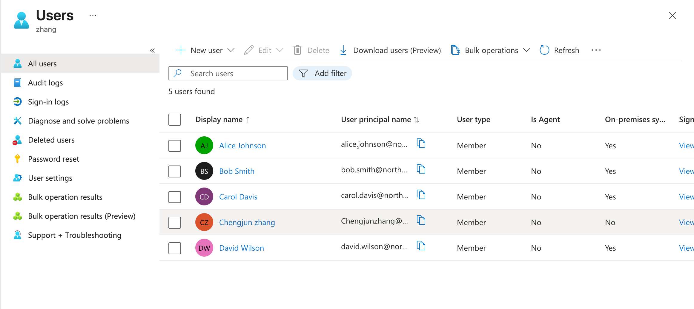

# **1. Hybrid Identity Overview**

Northstar Technologies maintains both an on-premises Active Directory environment and a Microsoft Entra ID cloud environment.

In this section, **Microsoft Entra Connect Sync** is configured to connect the on-premises **corp.lab Active Directory** with Microsoft Entra ID and establish a hybrid identity environment.

The existing on-premises Active Directory users are synchronized to Microsoft Entra ID and then verified in the cloud environment.

This demonstrates how an organization can manage user identities in its local Active Directory while making those identities available to Microsoft cloud services.

------

# **2. Configure Microsoft Entra Connect and Synchronize Users**

To build the hybrid identity environment, I installed **Microsoft Entra Connect Sync** on the Windows Server and connected the on-premises **corp.lab Active Directory** to the Microsoft Entra ID tenant.

Before synchronization, the UPN suffix of the four on-premises users was changed from **corp.lab** to **northstaritlab2026.onmicrosoft.com**, matching the sign-in domain used in Microsoft Entra ID. This provided consistent user sign-in names between the on-premises and cloud environments.

The following on-premises users were included in the synchronization scope:

- Alice Johnson
- Bob Smith
- Carol Davis
- David Wilson

Microsoft Entra Connect was then configured to synchronize the selected Active Directory users to Microsoft Entra ID.

After the configuration was completed, a delta synchronization cycle was manually triggered to synchronize the latest Active Directory changes immediately rather than waiting for the next scheduled synchronization cycle:

```powershell
Start-ADSyncSyncCycle -PolicyType Delta
```

The synchronization completed successfully. All four Active Directory users were created in Microsoft Entra ID and were shown as **On-premises sync = Yes**.

The administrator account remained a cloud-only account and therefore showed **On-premises sync = No**.

The successful synchronization confirmed that the on-premises Active Directory and Microsoft Entra ID environments were connected through Microsoft Entra Connect and that the selected local user identities were successfully provisioned to the cloud.








