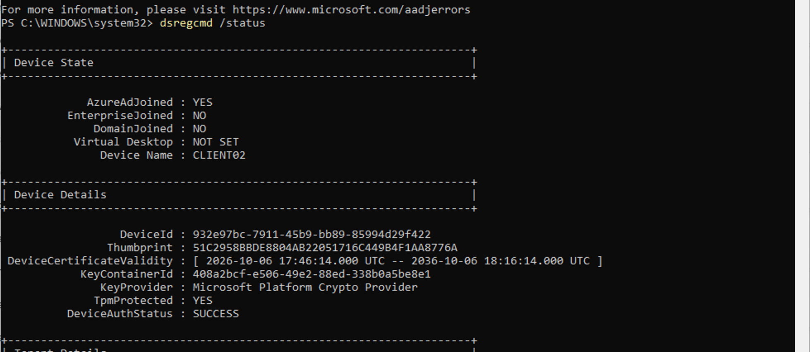
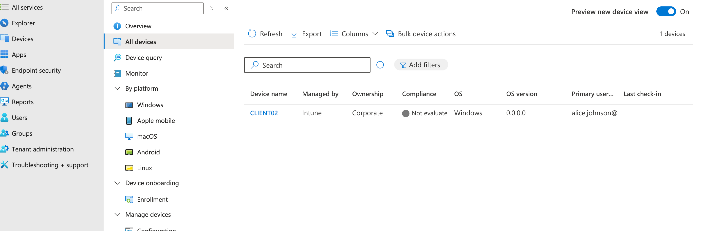
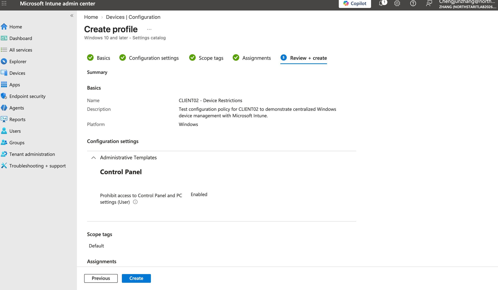
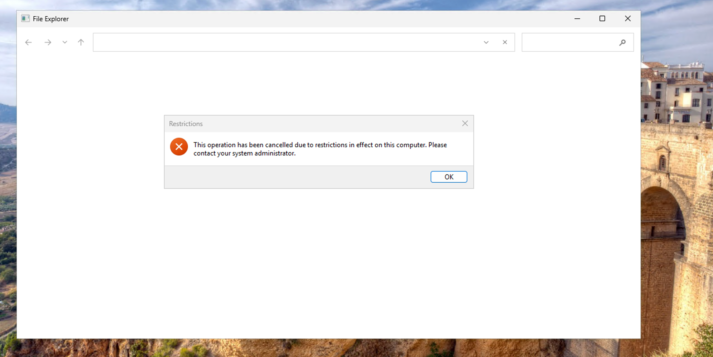
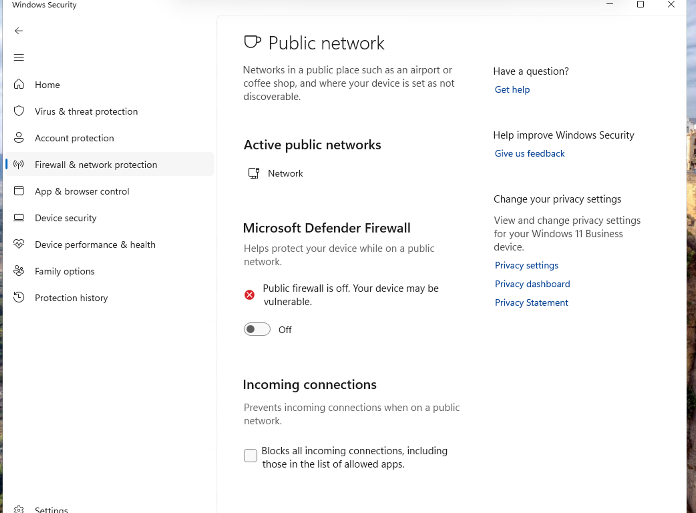
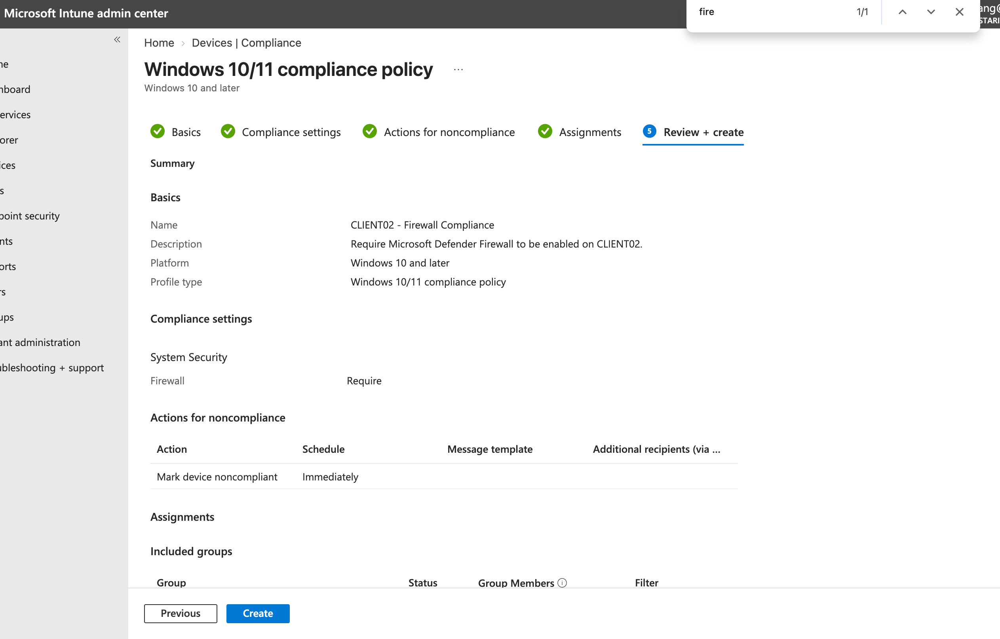
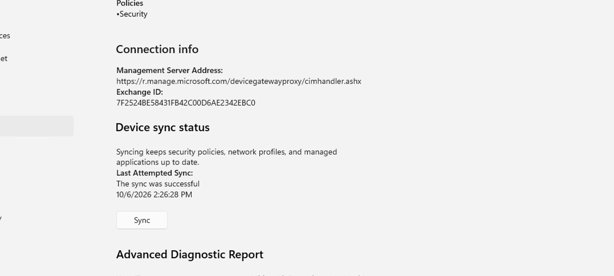
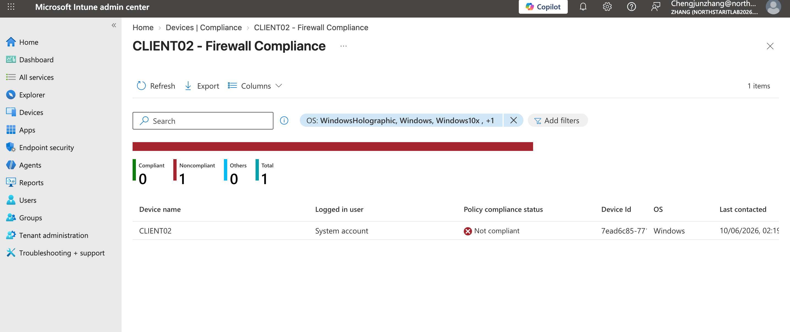

# **1. Intune & Endpoint Management Overview**

## **1.1 Background**

In the previous sections of this lab, the on-premises Active Directory environment was connected with Microsoft Entra ID through Microsoft Entra Connect.

This created a hybrid identity environment where identities can be managed across the on-premises and cloud environments.

The previous work mainly focused on **identity and access management**, including:

- Managing users and groups
- Authenticating users
- Managing device identities
- Controlling access to organizational resources
- Synchronizing identities between on-premises Active Directory and Microsoft Entra ID

However, managing identities is only one part of enterprise IT management.

An organization also needs to manage the **devices themselves**.

For example:

- Is the device managed by the organization?
- Does the device meet the company’s security requirements?
- Is antivirus protection enabled?
- Is the disk encrypted?
- Is the firewall enabled?
- Can company settings be deployed to the device?
- Can applications be installed remotely?
- Can IT administrators check the status of the device?

This is where **Microsoft Intune** is used.

------

## **1.2 What Is Microsoft Intune?**

**Microsoft Intune** is Microsoft’s cloud-based endpoint management platform.

While **Microsoft Entra ID mainly manages identities and access**, Intune mainly manages **devices, applications, configurations, and device compliance**.

A simplified distinction is:

**Microsoft Entra ID**

Who is the user or device, and what resources can it access?

**Microsoft Intune**

How should this device be configured and managed?

After a device is enrolled in Intune, administrators can centrally manage it without physically accessing the computer.

For example, administrators can:

- Deploy configuration policies
- Enforce security settings
- Check device compliance
- Deploy applications
- View device information and status
- Synchronize management policies with devices
- Perform certain remote management actions

------

## **1.3 Entra ID and Intune Work Together**

Entra ID and Intune perform different functions, but they are commonly used together.

A typical enterprise workflow is:

**User signs in with an Entra ID account**

↓

**Windows device joins Microsoft Entra ID**

↓

**The device receives an organizational identity**

↓

**The device is enrolled in Microsoft Intune**

↓

**Intune manages the device configuration and security requirements**

This means that:

- **Entra ID manages identity and access**
- **Intune manages endpoint configuration and compliance**

For example, Entra ID may identify a computer as an organizational device, while Intune can check whether that computer has BitLocker enabled, whether Microsoft Defender is active, and whether the device meets the organization’s security requirements.

------

## **1.4 Why Organizations Need Intune**

In a small environment, an IT administrator could configure computers manually.

This approach does not scale well in an enterprise environment.

If an organization has hundreds or thousands of laptops, IT staff cannot manually configure every computer whenever a security requirement or application changes.

Intune provides **centralized endpoint management**.

Instead of configuring devices individually, administrators can create policies once and assign them to users or devices.

For example:

The company requires all Windows laptops to use disk encryption and antivirus protection.

The administrator can create a policy in Intune and assign it to the appropriate devices.

Intune can then evaluate those devices and report whether they meet the required security configuration.

This allows IT teams to manage large numbers of endpoints consistently from a central management platform.

------

## **1.5 Goals of This Lab**

In this section of the Northstar Technologies IT Support Lab, Microsoft Intune will be used to simulate common enterprise endpoint-management tasks.

The lab will include:

1. Joining a Windows 11 device to Microsoft Entra ID and enrolling it in Intune.
2. Viewing and managing the enrolled device from the Intune Admin Center.
3. Creating and testing a Windows device compliance policy.
4. Deploying a configuration profile to the managed device.
5. Deploying an application through Intune.
6. Practicing common Intune troubleshooting tasks from an IT Support perspective.

The goal is not to build an advanced enterprise Intune architecture.

The goal is to understand the endpoint-management workflow commonly encountered by **Help Desk and IT Support professionals**:

**Identify the device → Enroll the device → Manage the device → Check compliance → Deploy configurations and applications → Troubleshoot problems.**

# 2. Microsoft Entra Join and Intune Enrollment

## 2.1 Enable Automatic Intune Enrollment

Before enrolling CLIENT02, automatic Intune enrollment was enabled by setting:

**MDM user scope = All**

This allows eligible Windows devices to automatically enroll in Intune when they are joined to Microsoft Entra ID by licensed users.

The expected workflow is:

**Microsoft Entra Join → Automatic Intune Enrollment**

---

## 2.2 Join CLIENT02 to Microsoft Entra ID

CLIENT02 was configured as the cloud-managed Windows client in this lab.

Alice Johnson's organizational account was used to join CLIENT02 to Microsoft Entra ID.

After the join, the device status was verified with:

    dsregcmd /status

---

## 2.3 Verify Intune Enrollment

Because automatic enrollment was enabled, the Microsoft Entra Join also triggered Intune enrollment.

CLIENT02 appeared in:

**Microsoft Intune Admin Center → Devices → All devices**

The device showed:

- **Device name:** CLIENT02
- **Managed by:** Intune
- **Ownership:** Corporate
- **Primary user:** Alice Johnson

This confirms that CLIENT02 is successfully enrolled and managed by Microsoft Intune.

# 3.**Intune Configuration Policy**

Use Microsoft Intune to apply a configuration policy to a managed Windows device and verify that the policy is successfully enforced.

In this lab, **Alice Johnson** was restricted from accessing Control Panel and Windows Settings on **CLIENT02**.

------

## **3.1. Create a Test User Group**

Created an Entra ID security group:

**Intune-Test-Users**

Added **Alice Johnson** to the group.

The group was used as the target for the Intune configuration policy.

------

## 3.**2. Create and Assign the Configuration Policy**

Created a Windows configuration policy in Microsoft Intune using the **Settings Catalog**.

Configured:

**Prohibit access to Control Panel and PC settings (User): Enabled**

The policy was assigned to **Intune-Test-Users**.

------

## 3.**3. Verify Policy Enforcement**

Signed in to **CLIENT02** using the Alice Johnson Entra ID account.

When Alice attempted to open Control Panel, Windows blocked the operation and displayed:

This operation has been cancelled due to restrictions in effect on this computer. Please contact your system administrator.

This confirmed that the Intune configuration policy was successfully delivered to CLIENT02 and enforced for the target user.

# 4.Device Compliance Policy

Use Microsoft Intune to verify whether **CLIENT02** meets the organization's firewall security requirement.

The test demonstrates how Intune detects a device that does not meet a compliance policy.

---

## 4.1. Create a Noncompliant Condition

On **CLIENT02**, I manually disabled the **Public network firewall** to simulate a device that does not meet the organization's security requirements.

**Evidence:** Windows Security shows that the Public firewall is turned off.

---

## 4.2. Create and Assign the Compliance Policy

I created a security group named **Intune-Test-Devices** and added **CLIENT02** to the group.

Then I created an Intune compliance policy with the following settings:

- **Policy:** CLIENT02 - Firewall Compliance
- **Platform:** Windows 10 and later
- **Firewall:** Require
- **Assignment:** Intune-Test-Devices
- **Action for noncompliance:** Mark device noncompliant immediately

**Evidence:** Intune compliance policy configuration and assignment.

---

## 4.3. Synchronize CLIENT02

On **CLIENT02**, I manually triggered an Intune synchronization:

**Settings → Accounts → Access work or school → Managed by zhang → Sync**

The synchronization completed successfully.

---

## 4.4. Verify the Compliance Result

After approximately five minutes, Intune evaluated **CLIENT02** and reported:

- **Compliant:** 0
- **Noncompliant:** 1
- **CLIENT02:** Not compliant

This confirms that Intune successfully detected that CLIENT02 did not meet the required firewall security configuration.

