# 1. Help Desk Ticket Simulation & User Lifecycle Overview

This chapter simulates common **Help Desk tickets** throughout an employee's account lifecycle.

A test employee will be used to demonstrate four common IT support scenarios:

1. **New Employee Onboarding**
   - Create the user account
   - Assign group membership
   - Synchronize the identity to Entra ID
   - Assign a Microsoft 365 license

2. **Account Lockout & Password Reset**
   - Simulate a user who cannot sign in
   - Unlock the account
   - Reset the password
   - Verify successful sign-in

3. **Department Transfer & Access Change**
   - Move the employee to another department
   - Update security group membership
   - Verify the new resource permissions

4. **Employee Offboarding**
   - Disable the user account
   - Remove group memberships
   - Block cloud sign-in
   - Remove the Microsoft 365 license

These scenarios demonstrate a complete employee identity lifecycle:

**Onboarding → Account Support → Access Change → Offboarding**


# 2. New Employee Onboarding

A new employee, **Emma Brown**, joined the HR department. A new domain account was created in Active Directory with the following configuration:

- **User:** Emma Brown
- **Username:** emma.brown
- **UPN:** emma.brown@northstaritlab2026.onmicrosoft.com
- **Department:** HR
- **Job Title:** HR Specialist
- **Company:** Northstar Technologies
- **OU:** Northstar / Users / HR
- **Security Group:** HR-Users

The account was placed in the **HR OU** and added to the **HR-Users** security group for department-based access.

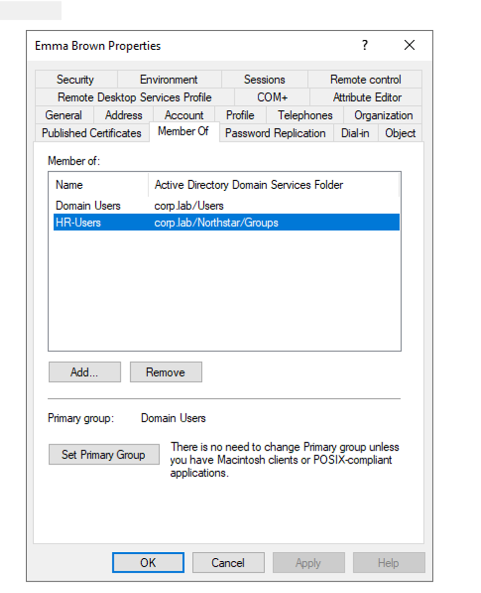


# 3. Synchronize the User to Microsoft Entra ID

Microsoft Entra Connect automatically synchronizes changes from on-premises Active Directory to Microsoft Entra ID on a scheduled cycle.

To avoid waiting for the next scheduled synchronization, I manually triggered a **Delta Sync**:

```powershell
Start-ADSyncSyncCycle -PolicyType Delta
```

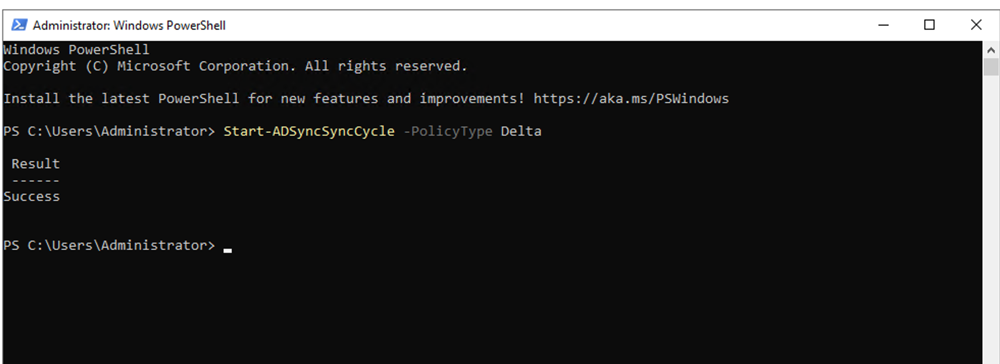

The synchronization completed successfully.

After waiting briefly, I verified the result in **Microsoft Entra ID**. **Emma Brown** appeared in the cloud with the expected UPN:

**emma.brown@northstaritlab2026.onmicrosoft.com**

This confirmed that the new on-premises AD user was successfully synchronized to Microsoft Entra ID.

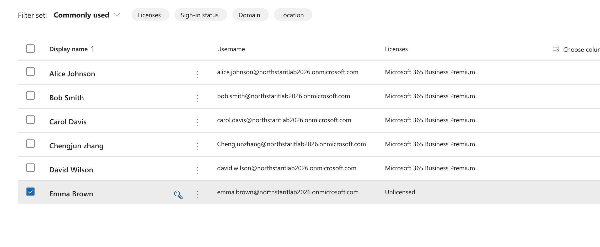


# 4. Cloud Account Provisioning and Verification

After **Emma Brown** was synchronized from the on-premises Active Directory to Microsoft Entra ID, I completed the cloud-side onboarding configuration and verified the account.

## Microsoft 365 License

Assigned **Microsoft 365 Business Premium** to Emma Brown.

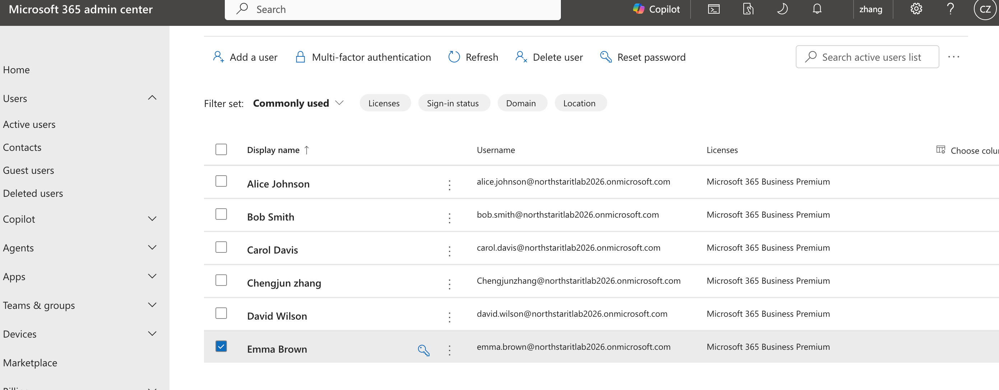

## Security Group Membership

Emma was already a member of the on-premises **HR-Users** security group.

The group and its membership were synchronized to Microsoft Entra ID through Entra Connect. I verified that Emma appeared as a member of the synchronized **HR-Users** group.

No additional cloud-side group membership was required.

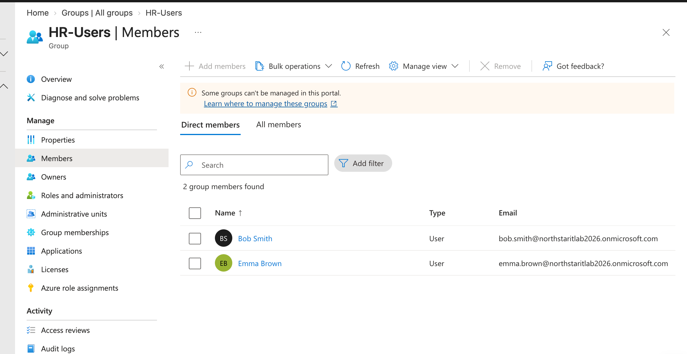


## Account Verification

Verified Emma's cloud account in Microsoft Entra ID:

- **UPN:** emma.brown@northstaritlab2026.onmicrosoft.com
- **User type:** Member
- **Account status:** Enabled
- **Group membership:** HR-Users
- **Microsoft 365 license:** Assigned

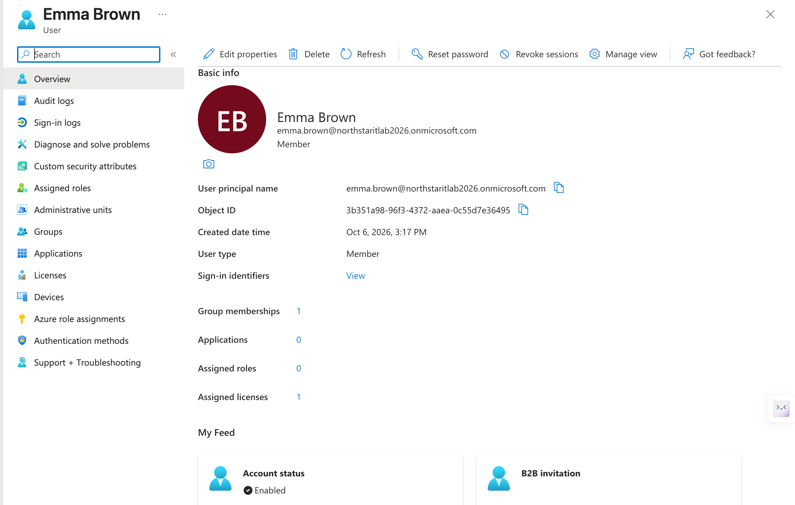

At this point, Emma's Microsoft Entra ID account was synchronized, licensed, enabled, and associated with the correct department security group.


# 5.Account Lockout and Password Reset

Simulate a common Help Desk ticket where a user account is locked after multiple failed sign-in attempts, then unlock the account and reset the user's password.

---

## 5.1. Configure Account Lockout Policy

Configured the domain Account Lockout Policy in Group Policy:

- **Account lockout threshold:** 3 invalid logon attempts
- **Account lockout duration:** 10 minutes
- **Reset account lockout counter after:** 10 minutes

This policy automatically locks a user account after three failed sign-in attempts.

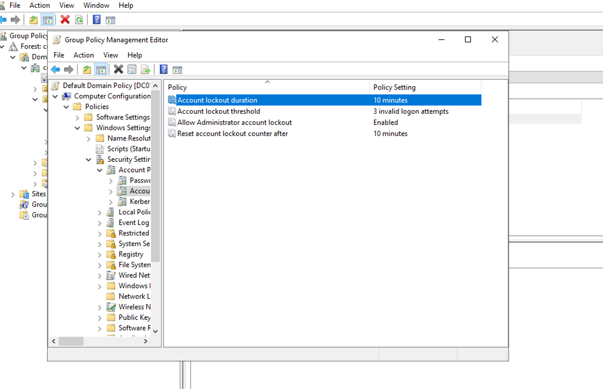

---

## 5.2. Verify the Account Lockout

Simulated multiple failed sign-in attempts using the **Emma Brown** domain account.

After three incorrect password attempts, Active Directory showed that the account was locked.

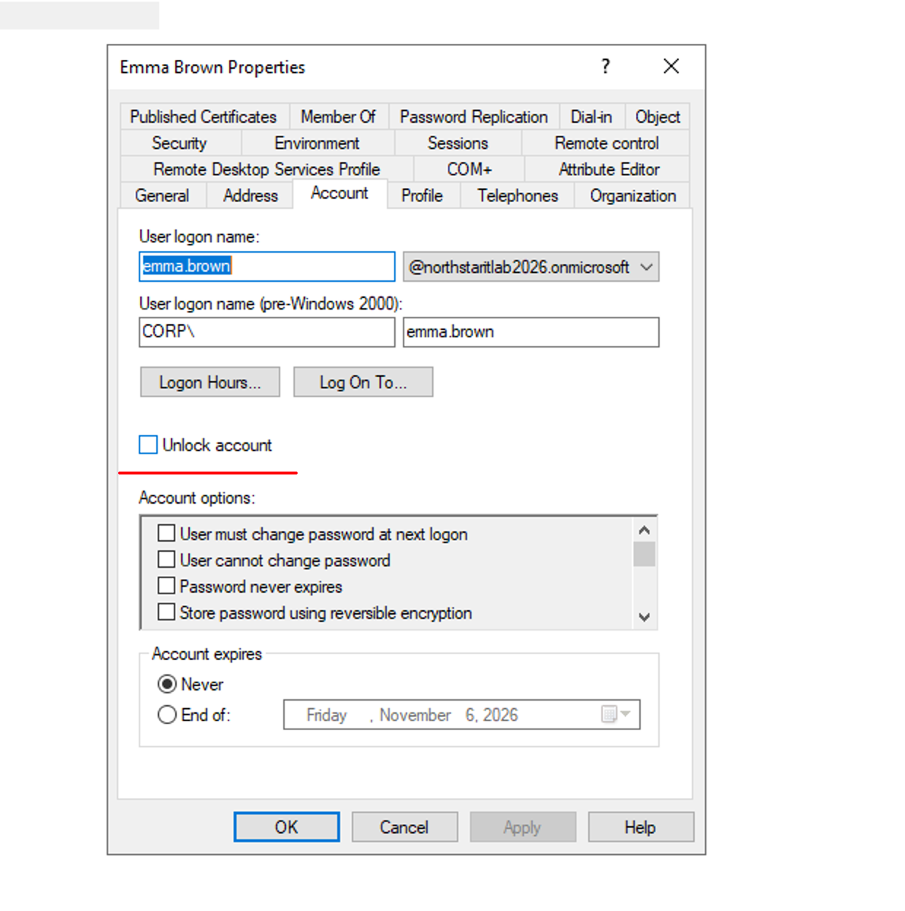

---

## 5.3. Unlock the Account and Reset the Password

As the administrator, I reset Emma's password and unlocked the account.

The account was restored and the new password was successfully set.

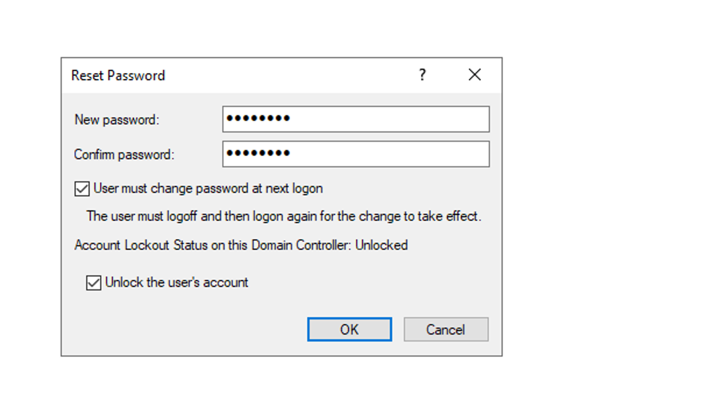


# 6.Employee Offboarding

Simulate the offboarding process for an employee leaving the organization.

The goal is to disable access, remove group-based permissions, terminate existing cloud sessions, and reclaim the Microsoft 365 license.

---

## 6.1. Disable the Active Directory Account

In **Active Directory Users and Computers**, I disabled **Emma Brown's** domain account to prevent future domain authentication.

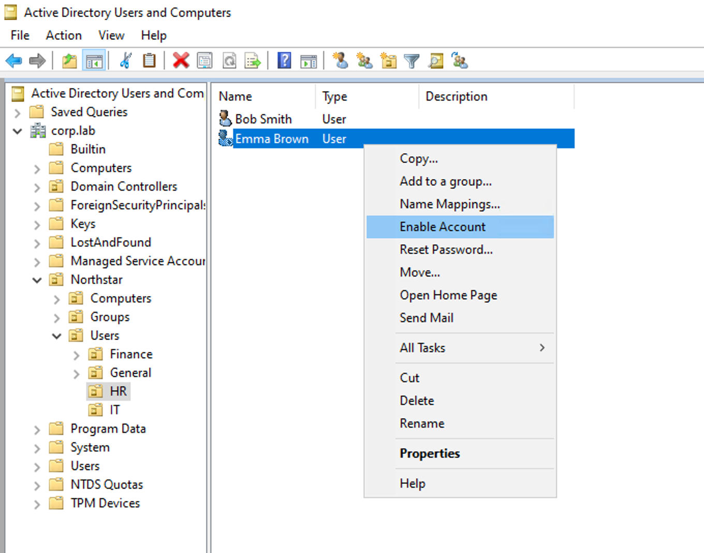

---

## 6.2. Remove Group Membership

I removed Emma from the **HR-Users** security group to remove access associated with her job role.

The default **Domain Users** membership was retained.

 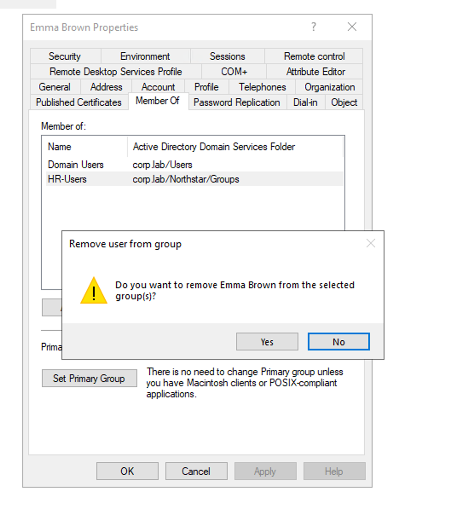

---

## 6.3. Synchronize the Change to Entra ID

After completing the on-premises changes, I triggered an **Entra Connect delta synchronization** so the updated account state and group membership were synchronized to the cloud.

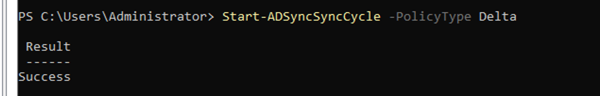

---

## 6.4. Revoke Existing Cloud Sessions

In **Microsoft Entra ID**, I revoked Emma's existing sessions.

This terminates existing cloud authentication sessions and requires the user to authenticate again.

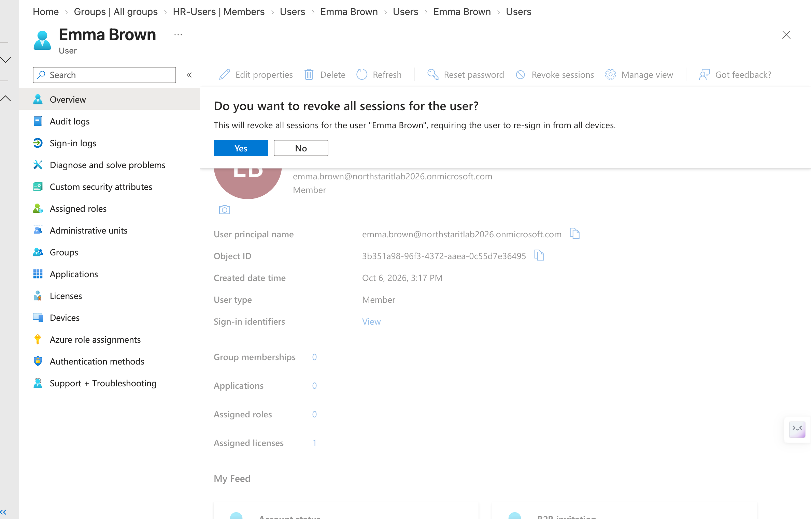 

---

## 6.5. Remove the Microsoft 365 License

Finally, I removed Emma's **Microsoft 365 Business Premium** license.

The Microsoft 365 admin center confirmed:

- **Sign-in blocked**
- **Licenses: 0**

This completed the employee offboarding process and returned the license to the organization's available license pool.

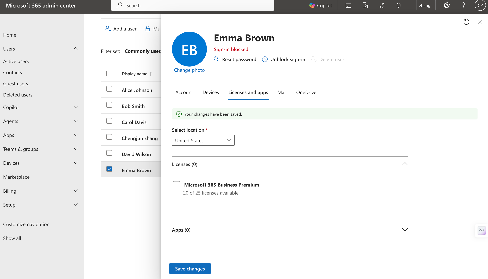


