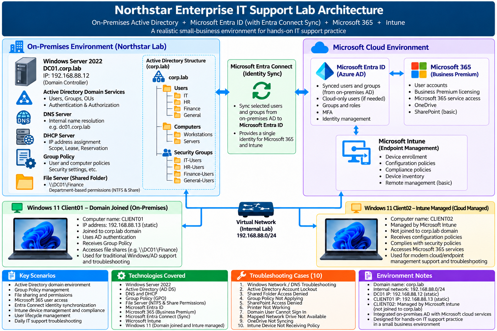

# **1. Project Overview**

The **Northstar Enterprise IT Support Lab** is a hands-on enterprise IT environment designed to simulate common infrastructure, system administration, and Help Desk operations in a small business environment.

The lab is built around a Windows Server 2022 Domain Controller and two Windows 11 Pro client workstations running as virtual machines in **Hyper-V**.

The environment combines traditional on-premises Windows infrastructure with Microsoft cloud services.

The project covers:

- Hyper-V virtualization
- Windows Server 2022
- Active Directory Domain Services
- DNS and DHCP
- Group Policy
- File Server and NTFS permissions
- Microsoft Entra ID
- Microsoft 365
- Entra Connect and hybrid identity
- Microsoft Intune
- User onboarding and offboarding
- IT Support troubleshooting

The initial Hyper-V environment contains three virtual machines:

```
DC01
Windows Server 2022
IP: 192.168.88.12
Role: Domain Controller / DNS Server
Domain: corp.lab

CLIENT01
Windows 11 Pro
IP: 192.168.88.13
Role: Traditional Active Directory domain workstation
Domain: corp.lab

CLIENT02
Windows 11 Pro
Role: Cloud identity and endpoint management workstation
Planned use: Microsoft Entra ID / Intune
```

**CLIENT01** is used primarily for traditional on-premises Active Directory administration, Group Policy, domain authentication, file permissions, and Help Desk scenarios.

**CLIENT02** is reserved for later Microsoft Entra ID and Intune exercises, allowing the lab to demonstrate both traditional domain-managed and modern cloud-managed Windows endpoints.

The overall architecture follows this model:

```
Hyper-V
   │
   ├── DC01
   │     └── Windows Server 2022
   │           ├── Active Directory
   │           ├── DNS / DHCP
   │           ├── Group Policy
   │           └── File Services
   │
   ├── CLIENT01
   │     └── Windows 11 Pro
   │           └── corp.lab Domain Joined
   │
   └── CLIENT02
         └── Windows 11 Pro
               └── Entra ID / Intune Lab

                     │
                     ▼
            Microsoft Cloud
                     │
                     ├── Entra ID
                     ├── Microsoft 365
                     ├── Entra Connect
                     └── Intune
```

The goal is not only to configure the technologies individually, but to build an integrated environment where common enterprise IT administration and troubleshooting scenarios can be practiced and documented.

------

# **2. Hyper-V Lab Environment**

The first stage of the project establishes the virtualization environment used by the rest of the lab.

Hyper-V is used to create and manage three virtual machines:

- **DC01** — Windows Server 2022
- **CLIENT01** — Windows 11 Pro
- **CLIENT02** — Windows 11 Pro

The lab environment includes:

- Hyper-V virtual networking
- Windows Server and Windows 11 virtual machines
- Stable network addressing
- Network connectivity between the host and virtual machines
- Remote administration access

**DC01** provides the Windows Server infrastructure for the lab.

**CLIENT01** is prepared for traditional Active Directory domain administration and workstation management.

**CLIENT02** is created as a separate Windows 11 workstation and reserved for later Microsoft Entra ID and Intune endpoint-management exercises.

At this stage, the purpose is to establish the virtual infrastructure. Domain membership and higher-level enterprise services are configured in later stages of the project.

[**View Hyper-V Lab Environment Documentation**](./docs/1.hyperv-lab-environment/readme.md)

------

# **3. Active Directory**

This stage builds the core Windows domain environment.

Active Directory Domain Services is installed on **DC01**, which is promoted to the Domain Controller for the **corp.lab** domain.

A Northstar organizational structure is created using Organizational Units for users and computers, together with departmental Security Groups.

Representative users are created for IT, HR, Finance, and General departments.

In this stage, **CLIENT01** is configured to use **DC01** as its DNS server and is joined to the **corp.lab** Active Directory domain.

The CLIENT01 computer object is then organized under the Northstar workstation OU.

A regular domain user, **CORP\alice.johnson**, is used to verify domain authentication and workstation access.

The lab also includes a Remote Desktop authorization troubleshooting scenario in which local domain login succeeds but RDP access initially fails because the regular domain user does not have Remote Desktop logon permission.

**CLIENT02 is intentionally not joined to the on-premises Active Directory domain at this stage.** It remains available for later Microsoft Entra ID and Intune exercises.

This stage establishes the identity and centralized administration foundation used throughout the rest of the project.

[**View Active Directory Documentation**](./docs/2.active-directory/readme.md)


# **4.DNS and DHCP Configuration**

Configured DNS and DHCP services on **DC01** to provide name resolution and centralized network configuration for the `corp.lab` domain.

### **DNS Configuration**

- Verified forward DNS records for **DC01** and **CLIENT01**
- Tested forward name resolution using `nslookup`
- Created a reverse lookup zone for the `192.168.88.0/24` network
- Created PTR records for DC01 and CLIENT01
- Verified reverse DNS resolution using `nslookup`


### **DHCP Configuration**

- Installed the DHCP Server role on DC01
- Authorized DC01 as a DHCP server in Active Directory
- Created and activated the **Corp LAN** DHCP scope
- Configured the address pool `192.168.88.100–192.168.88.200`
- Configured the default gateway as `192.168.88.1`
- Configured DC01 (`192.168.88.12`) as the DNS server
- Configured `corp.lab` as the DNS domain

[View DNS and DHCP Configuration →](./docs/3.dns-dhcp/readme.md)


# **5. Group Policy Configuration**

Group Policy was configured in the **corp.lab** domain to demonstrate centralized management of both domain users and domain computers.

Two Group Policy Objects were deployed:

- **IT User Policy** — applied to the IT OU to restrict user access to Control Panel and PC settings.
- **Workstation Security Policy** — applied to the Workstations OU to enforce Windows Defender Firewall settings on domain workstations.

The policies were successfully applied and verified using **Alice Johnson** and **CLIENT01**, demonstrating both User Configuration and Computer Configuration through Active Directory Group Policy.

[View Group Policy Configuration →](docs/4.group-policy/readme.md)


# **6. File Sharing and Permissions**

A departmental file share was configured on **DC01** to demonstrate centralized file access and permission management in a Windows domain environment.

NTFS permissions were configured to grant the **Finance-Users** security group appropriate access to the Finance folder, while Share Permissions were configured to control access to the folder over the network.

The shared folder was then mapped as the **F:** network drive on CLIENT01, demonstrating how authorized domain users can access shared enterprise resources from a Windows workstation.

[View File Sharing and Permissions Configuration →](docs/5.file-server-permissions/readme.md)


# 7. Microsoft Entra ID and Microsoft 365

After completing the on-premises Active Directory environment, the lab was extended to Microsoft Entra ID and Microsoft 365 to introduce cloud-based identity and service management.

The following tasks were completed:

- Created corresponding cloud user identities in Microsoft Entra ID
- Created security groups and organized users based on their departments
- Assigned Microsoft 365 Business Premium licenses to the cloud users
- Verified successful license activation and Microsoft 365 service access using a standard user account

This establishes the cloud identity environment that will be used for the following Microsoft 365, security, device management, and Intune configurations.

[View Microsoft Entra ID and Microsoft 365 Configuration](docs/6.entra-id-microsoft-365/readme.md)


# **8. Hybrid Identity — Microsoft Entra Connect**

Configured **Microsoft Entra Connect Sync** to integrate the on-premises **corp.lab Active Directory** with Microsoft Entra ID.

The on-premises user UPNs were aligned with the Microsoft Entra ID sign-in domain, and selected Active Directory users were synchronized to the cloud. Successful synchronization was verified in Microsoft Entra ID with the users showing **On-premises sync = Yes**.

This lab demonstrates the basic implementation of a **hybrid identity environment**, allowing identities managed in on-premises Active Directory to be provisioned and used in Microsoft cloud services.

[**View Hybrid Identity Lab →**](./docs/7.entra-connect-identity-sync/readme.md)


# 9. Microsoft Intune – Device Management and Compliance

Configured Microsoft Intune to manage **CLIENT02**, including device enrollment, centralized policy deployment, and device compliance monitoring.

Key tasks:
- Enrolled **CLIENT02** into Microsoft Intune
- Verified device management and synchronization
- Created and assigned an Intune configuration policy
- Restricted Control Panel access for a test user
- Created a device security group for compliance testing
- Created a firewall compliance policy
- Simulated a noncompliant device by disabling Windows Firewall
- Synchronized CLIENT02 with Intune
- Verified that Intune detected CLIENT02 as **Noncompliant**

[View detailed Intune lab notes](docs/8.intune-endpoint-management/readme.md)


# 10.User Lifecycle Management

Simulated a complete employee lifecycle in a hybrid Active Directory and Microsoft Entra ID environment, covering common Help Desk and IT Support tasks from onboarding to offboarding.

The workflow included:

- Created a new employee account in on-premises Active Directory
- Assigned the user to the appropriate departmental security group
- Synchronized the user and group membership to Microsoft Entra ID
- Assigned a Microsoft 365 Business Premium license
- Verified the synchronized cloud identity and group membership
- Configured and tested an account lockout policy
- Simulated a locked user account and performed account recovery
- Reset the user's password and required a password change at next sign-in
- Simulated employee offboarding by disabling the account and removing role-based group access
- Revoked existing cloud sessions and reclaimed the Microsoft 365 license

This lab demonstrates a practical **Joiner → Support → Leaver** workflow across on-premises Active Directory and Microsoft cloud services.

**[View the detailed User Lifecycle Management lab →](docs/9.user-lifecycle-help-desk/readme.md)**


# 11. Troubleshooting Scenarios

This section documents common **Help Desk and IT Support troubleshooting scenarios** across Windows, Active Directory, Microsoft 365, and Intune.

The scenarios demonstrate a structured troubleshooting approach: identifying the problem, checking possible causes, determining the root cause, applying a resolution, and verifying the result.

1. **Windows Network / DNS Troubleshooting**
2. **Active Directory Account Lockout**
3. **Shared Folder Access Denied**
4. **Group Policy Not Applying**
5. **SharePoint Access Denied**
6. **Printer Not Working**
7. **Domain User Cannot Sign In**
8. **Mapped Network Drive Not Available**
9. **OneDrive Not Syncing**
10. **Intune Device Not Receiving Policy**

For detailed troubleshooting steps, root causes, resolutions, and verification results, see:

[**View Detailed Troubleshooting Scenarios**](docs/10.troubleshooting-documentation/readme.md)




# Northstar Enterprise IT Support Lab

## Project Highlights

This project demonstrates hands-on experience with both traditional Windows enterprise infrastructure and modern Microsoft cloud administration.

- **Active Directory & Group Policy** — Built and managed a Windows Server 2022 domain environment with users, groups, OUs, domain-joined workstations, and centralized Group Policy.
- **Hybrid Identity & Microsoft 365** — Integrated on-premises Active Directory with Microsoft Entra ID using Entra Connect and managed Microsoft 365 identities and licenses.
- **Intune Endpoint Management** — Enrolled and managed a Windows 11 endpoint, deployed configuration policies, and tested device compliance.
- **Help Desk Troubleshooting** — Documented 10 troubleshooting scenarios covering DNS, Active Directory accounts, permissions, Group Policy, SharePoint, printers, mapped drives, OneDrive, and Intune.

[**View Troubleshooting Scenarios →**](docs/10.troubleshooting-documentation/readme.md)

---

## Quick Navigation

| Section                                                    | Detailed Documentation                                       |
| ---------------------------------------------------------- | ------------------------------------------------------------ |
| **2. Hyper-V Lab Environment**                             | [View Documentation →](./docs/1.hyperv-lab-environment/readme.md) |
| **3. Active Directory**                                    | [View Documentation →](./docs/2.active-directory/readme.md)  |
| **4. DNS and DHCP Configuration**                          | [View Documentation →](./docs/3.dns-dhcp/readme.md)          |
| **5. Group Policy Configuration**                          | [View Documentation →](docs/4.group-policy/readme.md)        |
| **6. File Sharing and Permissions**                        | [View Documentation →](docs/5.file-server-permissions/readme.md) |
| **7. Microsoft Entra ID and Microsoft 365**                | [View Documentation →](docs/6.entra-id-microsoft-365/readme.md) |
| **8. Hybrid Identity — Microsoft Entra Connect**           | [View Documentation →](./docs/7.entra-connect-identity-sync/readme.md) |
| **9. Microsoft Intune — Device Management and Compliance** | [View Documentation →](docs/8.intune-endpoint-management/readme.md) |
| **10. User Lifecycle Management**                          | [View Documentation →](docs/9.user-lifecycle-help-desk/readme.md) |
| **11. Troubleshooting Scenarios**                          | [**View Troubleshooting →**](docs/10.troubleshooting-documentation/readme.md) |

---

# 1. Project Overview

The **Northstar Enterprise IT Support Lab** is a hands-on enterprise IT environment designed to simulate common infrastructure administration, system administration, and Help Desk operations in a small business environment.

The lab combines traditional on-premises Windows infrastructure with Microsoft cloud services.

### Core Environment

- **DC01** — Windows Server 2022 Domain Controller providing Active Directory, DNS, DHCP, Group Policy, and File Services
- **CLIENT01** — Windows 11 Pro workstation joined to the **corp.lab** Active Directory domain
- **CLIENT02** — Windows 11 Pro endpoint managed through Microsoft Entra ID and Microsoft Intune

### Technologies

- Hyper-V
- Windows Server 2022
- Active Directory Domain Services
- DNS and DHCP
- Group Policy
- File Server and NTFS permissions
- Microsoft Entra ID
- Microsoft 365
- Microsoft Entra Connect
- Microsoft Intune
- Hybrid identity
- User lifecycle management
- Help Desk troubleshooting

The project demonstrates the implementation, administration, and troubleshooting of an integrated **Windows + Active Directory + Microsoft 365 + Entra ID + Intune** environment.

---

# 2. Hyper-V Lab Environment

The first stage of the project establishes the virtualization environment used by the rest of the lab.

Hyper-V is used to create and manage three virtual machines:

- **DC01** — Windows Server 2022
- **CLIENT01** — Windows 11 Pro
- **CLIENT02** — Windows 11 Pro

The lab environment includes:

- Hyper-V virtual networking
- Windows Server and Windows 11 virtual machines
- Stable network addressing
- Network connectivity between the host and virtual machines
- Remote administration access

**DC01** provides the Windows Server infrastructure for the lab.

**CLIENT01** is used for traditional Active Directory domain administration and workstation management.

**CLIENT02** is used as a cloud-managed Windows endpoint for Microsoft Entra ID and Microsoft Intune exercises.

[**View Hyper-V Lab Environment Documentation**](./docs/1.hyperv-lab-environment/readme.md)

---

# 3. Active Directory

This stage builds the core Windows domain environment.

Active Directory Domain Services is installed on **DC01**, which is promoted to the Domain Controller for the **corp.lab** domain.

A Northstar organizational structure is created using Organizational Units for users and computers, together with departmental Security Groups.

Representative users are created for IT, HR, Finance, and General departments.

**CLIENT01** is configured to use **DC01** as its DNS server and is joined to the **corp.lab** Active Directory domain.

The CLIENT01 computer object is then organized under the Northstar workstation OU.

A regular domain user, **CORP\alice.johnson**, is used to verify domain authentication and workstation access.

The lab also includes a Remote Desktop authorization troubleshooting scenario in which local domain login succeeds but RDP access initially fails because the regular domain user does not have Remote Desktop logon permission.

**CLIENT02** is intentionally kept separate from the traditional on-premises domain workstation configuration and is used for Microsoft Entra ID and Intune endpoint-management exercises.

This stage establishes the identity and centralized administration foundation used throughout the rest of the project.

[**View Active Directory Documentation**](./docs/2.active-directory/readme.md)

---

# 4. DNS and DHCP Configuration

Configured DNS and DHCP services on **DC01** to provide name resolution and centralized network configuration for the **corp.lab** domain.

### DNS Configuration

- Verified forward DNS records for **DC01** and **CLIENT01**
- Tested forward name resolution using **nslookup**
- Created a reverse lookup zone for the **192.168.88.0/24** network
- Created PTR records for DC01 and CLIENT01
- Verified reverse DNS resolution using **nslookup**

### DHCP Configuration

- Installed the DHCP Server role on DC01
- Authorized DC01 as a DHCP server in Active Directory
- Created and activated the **Corp LAN** DHCP scope
- Configured the address pool **192.168.88.100–192.168.88.200**
- Configured the default gateway as **192.168.88.1**
- Configured DC01 (**192.168.88.12**) as the DNS server
- Configured **corp.lab** as the DNS domain

[**View DNS and DHCP Configuration →**](./docs/3.dns-dhcp/readme.md)

---

# 5. Group Policy Configuration

Group Policy was configured in the **corp.lab** domain to demonstrate centralized management of both domain users and domain computers.

Two Group Policy Objects were deployed:

- **IT User Policy** — applied to the IT OU to restrict user access to Control Panel and PC settings.
- **Workstation Security Policy** — applied to the Workstations OU to enforce Windows Defender Firewall settings on domain workstations.

The policies were successfully applied and verified using **Alice Johnson** and **CLIENT01**, demonstrating both User Configuration and Computer Configuration through Active Directory Group Policy.

[**View Group Policy Configuration →**](docs/4.group-policy/readme.md)

---

# 6. File Sharing and Permissions

A departmental file share was configured on **DC01** to demonstrate centralized file access and permission management in a Windows domain environment.

NTFS permissions were configured to grant the **Finance-Users** security group appropriate access to the Finance folder, while Share Permissions were configured to control access to the folder over the network.

The shared folder was then mapped as the **F:** network drive on CLIENT01, demonstrating how authorized domain users can access shared enterprise resources from a Windows workstation.

[**View File Sharing and Permissions Configuration →**](docs/5.file-server-permissions/readme.md)

---

# 7. Microsoft Entra ID and Microsoft 365

After completing the on-premises Active Directory environment, the lab was extended to Microsoft Entra ID and Microsoft 365 to introduce cloud-based identity and service management.

The following tasks were completed:

- Created corresponding cloud user identities in Microsoft Entra ID
- Created security groups and organized users based on their departments
- Assigned Microsoft 365 Business Premium licenses to the cloud users
- Verified successful license activation and Microsoft 365 service access using a standard user account

This established the cloud identity environment used for Microsoft 365, security, hybrid identity, and endpoint-management exercises.

[**View Microsoft Entra ID and Microsoft 365 Configuration →**](docs/6.entra-id-microsoft-365/readme.md)

---

# 8. Hybrid Identity — Microsoft Entra Connect

Configured **Microsoft Entra Connect Sync** to integrate the on-premises **corp.lab Active Directory** with Microsoft Entra ID.

The on-premises user UPNs were aligned with the Microsoft Entra ID sign-in domain, and selected Active Directory users were synchronized to the cloud.

Successful synchronization was verified in Microsoft Entra ID with the users showing **On-premises sync = Yes**.

This lab demonstrates the basic implementation of a **hybrid identity environment**, allowing identities managed in on-premises Active Directory to be provisioned and used in Microsoft cloud services.

[**View Hybrid Identity Lab →**](./docs/7.entra-connect-identity-sync/readme.md)

---

# 9. Microsoft Intune — Device Management and Compliance

Configured Microsoft Intune to manage **CLIENT02**, including device enrollment, centralized policy deployment, and device compliance monitoring.

Key tasks:

- Enrolled **CLIENT02** into Microsoft Intune
- Verified device management and synchronization
- Created and assigned an Intune configuration policy
- Restricted Control Panel access for a test user
- Created a device security group for compliance testing
- Created a firewall compliance policy
- Simulated a noncompliant device by disabling Windows Firewall
- Synchronized CLIENT02 with Intune
- Verified that Intune detected CLIENT02 as **Noncompliant**

[**View Detailed Intune Lab Notes →**](docs/8.intune-endpoint-management/readme.md)

---

# 10. User Lifecycle Management

Simulated a complete employee lifecycle in a hybrid Active Directory and Microsoft Entra ID environment, covering common Help Desk and IT Support tasks from onboarding to offboarding.

The workflow included:

- Created a new employee account in on-premises Active Directory
- Assigned the user to the appropriate departmental security group
- Synchronized the user and group membership to Microsoft Entra ID
- Assigned a Microsoft 365 Business Premium license
- Verified the synchronized cloud identity and group membership
- Configured and tested an account lockout policy
- Simulated a locked user account and performed account recovery
- Reset the user's password and required a password change at next sign-in
- Simulated employee offboarding by disabling the account and removing role-based group access
- Revoked existing cloud sessions and reclaimed the Microsoft 365 license

This lab demonstrates a practical **Joiner → Support → Leaver** workflow across on-premises Active Directory and Microsoft cloud services.

[**View Detailed User Lifecycle Management Lab →**](docs/9.user-lifecycle-help-desk/readme.md)

---

# 11. Troubleshooting Scenarios

This section documents common **Help Desk and IT Support troubleshooting scenarios** across Windows, Active Directory, Microsoft 365, and Intune.

The scenarios demonstrate a structured troubleshooting approach: identifying the problem, checking possible causes, determining the root cause, applying a resolution, and verifying the result.

1. **Windows Network / DNS Troubleshooting**
2. **Active Directory Account Lockout**
3. **Shared Folder Access Denied**
4. **Group Policy Not Applying**
5. **SharePoint Access Denied**
6. **Printer Not Working**
7. **Domain User Cannot Sign In**
8. **Mapped Network Drive Not Available**
9. **OneDrive Not Syncing**
10. **Intune Device Not Receiving Policy**

For detailed troubleshooting steps, root causes, resolutions, and verification results, see:

[**View Detailed Troubleshooting Scenarios →**](docs/10.troubleshooting-documentation/readme.md)

