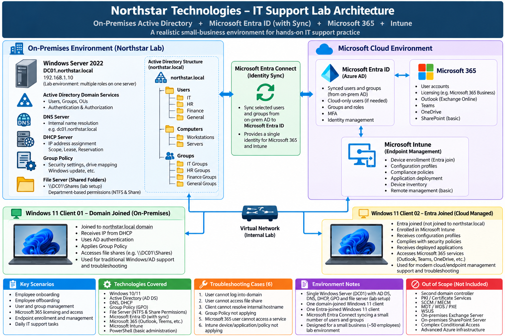

# **1. Project Overview**

The **Northstar Enterprise IT Support Lab** is a hands-on enterprise IT environment designed to simulate common infrastructure, system administration, and Help Desk operations in a small business environment.

The lab is built around a Windows Server 2022 Domain Controller and two Windows 11 Pro client workstations running as virtual machines in **Hyper-V**.

The environment combines traditional on-premises Windows infrastructure with Microsoft cloud services.

The project covers:

- Hyper-V virtualization
- Windows Server 2022
- Active Directory Domain Services
- DNS and DHCP
- Group Policy
- File Server and NTFS permissions
- Microsoft Entra ID
- Microsoft 365
- Entra Connect and hybrid identity
- Microsoft Intune
- User onboarding and offboarding
- IT Support troubleshooting

The initial Hyper-V environment contains three virtual machines:

```
DC01
Windows Server 2022
IP: 192.168.88.12
Role: Domain Controller / DNS Server
Domain: corp.lab

CLIENT01
Windows 11 Pro
IP: 192.168.88.13
Role: Traditional Active Directory domain workstation
Domain: corp.lab

CLIENT02
Windows 11 Pro
Role: Cloud identity and endpoint management workstation
Planned use: Microsoft Entra ID / Intune
```

**CLIENT01** is used primarily for traditional on-premises Active Directory administration, Group Policy, domain authentication, file permissions, and Help Desk scenarios.

**CLIENT02** is reserved for later Microsoft Entra ID and Intune exercises, allowing the lab to demonstrate both traditional domain-managed and modern cloud-managed Windows endpoints.

The overall architecture follows this model:

```
Hyper-V
   │
   ├── DC01
   │     └── Windows Server 2022
   │           ├── Active Directory
   │           ├── DNS / DHCP
   │           ├── Group Policy
   │           └── File Services
   │
   ├── CLIENT01
   │     └── Windows 11 Pro
   │           └── corp.lab Domain Joined
   │
   └── CLIENT02
         └── Windows 11 Pro
               └── Entra ID / Intune Lab

                     │
                     ▼
            Microsoft Cloud
                     │
                     ├── Entra ID
                     ├── Microsoft 365
                     ├── Entra Connect
                     └── Intune
```

The goal is not only to configure the technologies individually, but to build an integrated environment where common enterprise IT administration and troubleshooting scenarios can be practiced and documented.

------

# **2. Hyper-V Lab Environment**

The first stage of the project establishes the virtualization environment used by the rest of the lab.

Hyper-V is used to create and manage three virtual machines:

- **DC01** — Windows Server 2022
- **CLIENT01** — Windows 11 Pro
- **CLIENT02** — Windows 11 Pro

The lab environment includes:

- Hyper-V virtual networking
- Windows Server and Windows 11 virtual machines
- Stable network addressing
- Network connectivity between the host and virtual machines
- Remote administration access

**DC01** provides the Windows Server infrastructure for the lab.

**CLIENT01** is prepared for traditional Active Directory domain administration and workstation management.

**CLIENT02** is created as a separate Windows 11 workstation and reserved for later Microsoft Entra ID and Intune endpoint-management exercises.

At this stage, the purpose is to establish the virtual infrastructure. Domain membership and higher-level enterprise services are configured in later stages of the project.

[**View Hyper-V Lab Environment Documentation**](./docs/1.hyperv-lab-environment/readme.md)

------

# **3. Active Directory**

This stage builds the core Windows domain environment.

Active Directory Domain Services is installed on **DC01**, which is promoted to the Domain Controller for the **corp.lab** domain.

A Northstar organizational structure is created using Organizational Units for users and computers, together with departmental Security Groups.

Representative users are created for IT, HR, Finance, and General departments.

In this stage, **CLIENT01** is configured to use **DC01** as its DNS server and is joined to the **corp.lab** Active Directory domain.

The CLIENT01 computer object is then organized under the Northstar workstation OU.

A regular domain user, **CORP\alice.johnson**, is used to verify domain authentication and workstation access.

The lab also includes a Remote Desktop authorization troubleshooting scenario in which local domain login succeeds but RDP access initially fails because the regular domain user does not have Remote Desktop logon permission.

**CLIENT02 is intentionally not joined to the on-premises Active Directory domain at this stage.** It remains available for later Microsoft Entra ID and Intune exercises.

This stage establishes the identity and centralized administration foundation used throughout the rest of the project.

[**View Active Directory Documentation**](./docs/2.active-directory/readme.md)

## **3. DNS and DHCP Configuration**

Configured DNS and DHCP services on **DC01** to provide name resolution and centralized network configuration for the `corp.lab` domain.

### **DNS Configuration**

- Verified forward DNS records for **DC01** and **CLIENT01**
- Tested forward name resolution using `nslookup`
- Created a reverse lookup zone for the `192.168.88.0/24` network
- Created PTR records for DC01 and CLIENT01
- Verified reverse DNS resolution using `nslookup`


### **DHCP Configuration**

- Installed the DHCP Server role on DC01
- Authorized DC01 as a DHCP server in Active Directory
- Created and activated the **Corp LAN** DHCP scope
- Configured the address pool `192.168.88.100–192.168.88.200`
- Configured the default gateway as `192.168.88.1`
- Configured DC01 (`192.168.88.12`) as the DNS server
- Configured `corp.lab` as the DNS domain

[View DNS and DHCP Configuration →](./docs/3.dns-dhcp/readme.md)